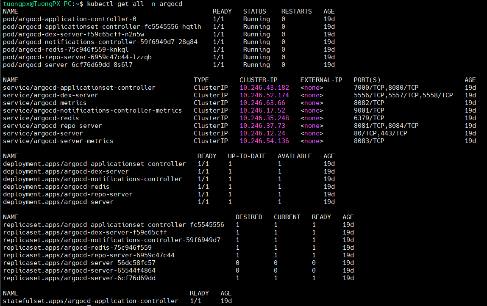

# Hands-on lab ArgoCD install on Kubernetes

## Preparing environment
- Check kubernetes cluster nodes. In this lab, I have a kubernetes cluster with: 01 master and 02 worker.
```bash
kubectl get nodes -owide
```


- Check ingress service on cluster
```bash
kubectl get svc -n ingress-controller
```


✔ Everything is ready. Let's go !!!

## ArgoCD Install
### Create namespace and install argocd
```bash
kubectl create namespace argocd
kubectl apply -n argocd -f https://raw.githubusercontent.com/argoproj/argo-cd/stable/manifests/install.yaml
```
### Verify argo component on cluster
```bash
kubectl get all -n argocd
```



