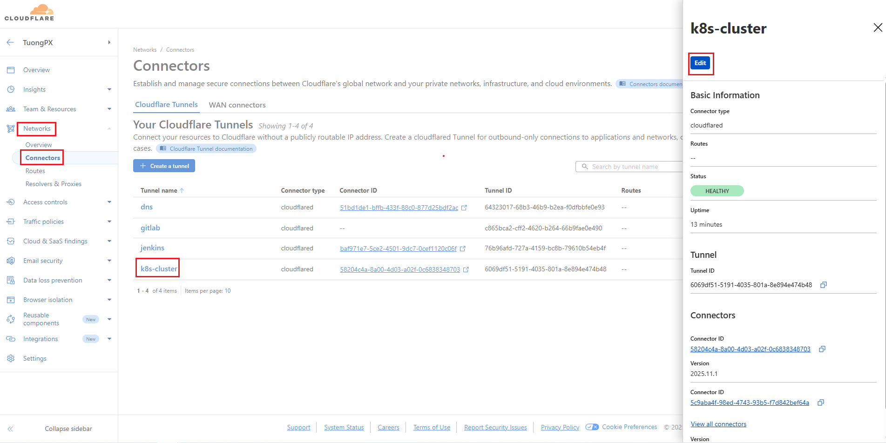
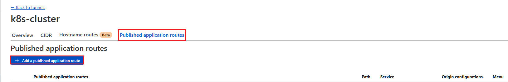
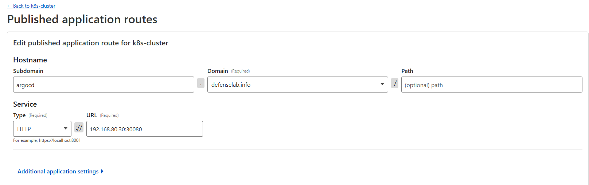
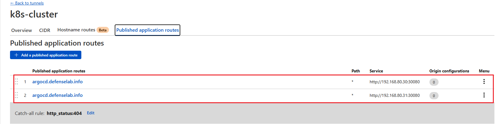
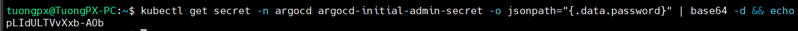
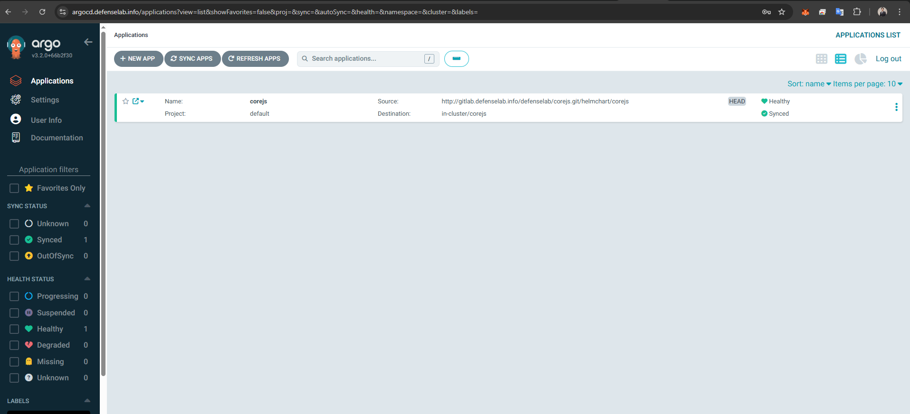

# Hands-on lab ArgoCD install on Kubernetes

## Preparing environment
- Check kubernetes cluster nodes. In this lab, I have a kubernetes cluster with: 01 master and 02 worker.
```bash
kubectl get nodes -owide
```


- Check ingress service on cluster
```bash
kubectl get svc -n ingress-controller
```


✔ Everything is ready. Let's go !!!

## ArgoCD Install
### Create namespace and install argocd
```bash
kubectl create namespace argocd
kubectl apply -n argocd -f https://raw.githubusercontent.com/argoproj/argo-cd/stable/manifests/install.yaml
```
### Verify argo component on cluster
```bash
kubectl get all -n argocd
```


### Config ArgoCD Ingress Service
- Create `argocd-ingress.yaml`

```bash
apiVersion: networking.k8s.io/v1
kind: Ingress
metadata:
  name: argocd-ingress
  namespace: argocd
  annotations:
    nginx.ingress.kubernetes.io/backend-protocol: "HTTP"
    nginx.ingress.kubernetes.io/grpc-backend: "true"
spec:
  ingressClassName: nginx
  rules:
    - host: argocd.defenselab.info
      http:
        paths:
          - path: /
            pathType: Prefix
            backend:
              service:
                name: argocd-server
                port:
                  number: 80
```
- Apply ingress service
```bash
kubectl apply -f argocd-ingress.yaml
```
### Config Cloudflare Zerotrust to access ArgoCD from public
- Access to Cloudflare dashboard `https://one.dash.cloudflare.com/`, select `Zero trust` --> Select `Network`--> Select `Tunnel` --> Select `edit`


- In `Published application routes` --> Select `Add a published application routes`


- Create two DNS records for ArgoCD — one for each Kubernetes worker node. In this lab, I have two worker nodes with IP addresses 192.168.80.30 and 192.168.80.31, so I will create two records pointing to these nodes. I will create the first one for 192.168.80.30
    - Subdomain: argocd

    - Domain: defenselab.info

    - Service → Type: choose HTTP
    
    - Service → URL: 192.168.80.30:30080

- ⚠️ Note: Port 30080 is the port of your Nginx Ingress that was configured earlier



- Create another record for 192.168.80.31, the result as bellow



- Get the password login to ArgoCD

```bash
kubectl get secret -n argocd argocd-initial-admin-secret -o jsonpath="{.data.password}" | base64 -d && echo
```


- Now, login to Argo web interface with `admin` and inital password



