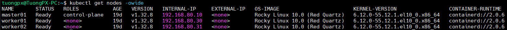
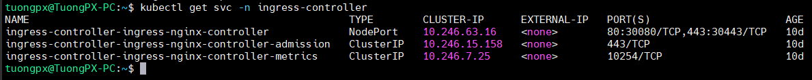

# Hands-on lab ArgoCD install on Kubernetes

## Preparing environment
- Check kubernetes cluster nodes. In this lab, I have a kubernetes cluster with: 01 master and 02 worker.
```bash
kubectl get nodes -owide
```


- Check ingress service on cluster
```bash
kubectl get svc -n ingress-controller
```



