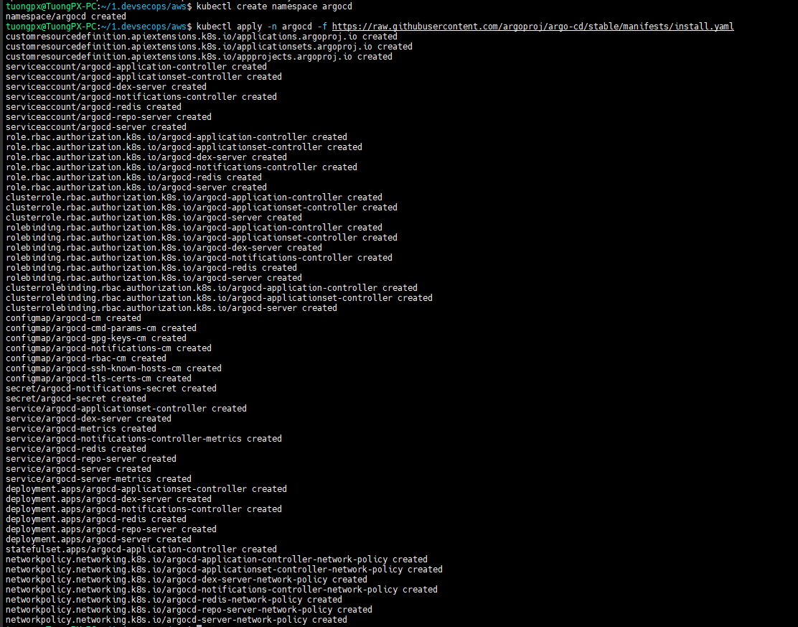
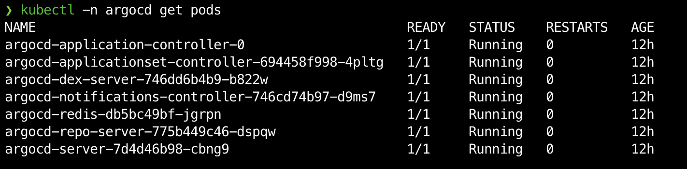
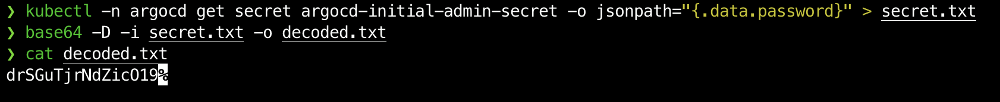
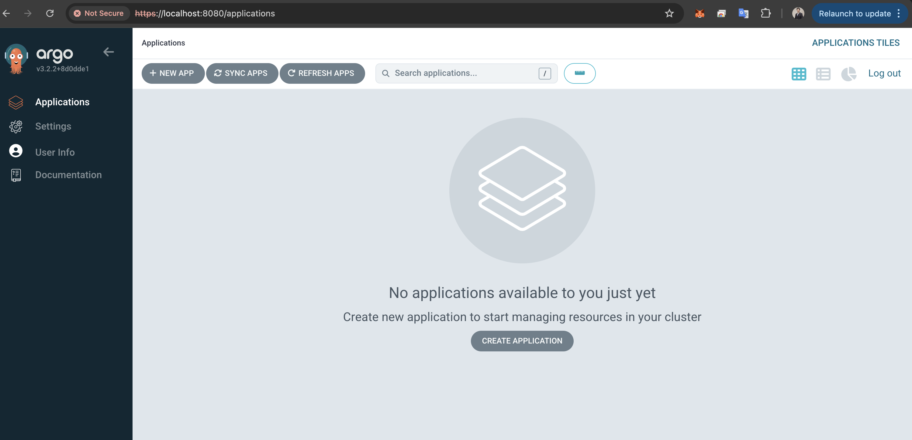

# LAB 02: Triển Khai ArgoCD Trên AWS

## PHẦN 1: CÀI ĐẶT ARGOCD

Trước hết, ta cần cài ArgoCD vào cụm EKS mới tạo.

### Bước 1: Cài đặt (Install)
Mở Terminal (đã trỏ vào cluster tuongpx-lab-cluster), chạy lần lượt:

```bash
# 1. Tạo phòng riêng (Namespace) cho ArgoCD để cách ly với ứng dụng khác
kubectl create namespace argocd

# 2. Cài đặt ArgoCD từ manifest chính hãng (Bản Stable)
kubectl apply -n argocd -f https://raw.githubusercontent.com/argoproj/argo-cd/stable/manifests/install.yaml
```


- Kiểm tra 
```bash
kubectl get pods -n argocd
```


## PHẦN 2: ĐĂNG NHẬP VÀO ARGOCD
ArgoCD mặc định không công khai ra Internet (để bảo mật). Chúng ta sẽ dùng kỹ thuật “đào hầm” (Port Forward) để truy cập từ máy tính local.

### Bước 1: Lấy mật khẩu Admin
ArgoCD tự động tạo mật khẩu ngẫu nhiên. Chạy các lệnh dưới đây để lấy mật khẩu:

- Windows/ Linux

```bash
kubectl -n argocd get secret argocd-initial-admin-secret -o jsonpath="{.data.password}" > secret.txt
certutil -decode secret.txt decoded.txt
type decoded.txt
```
- Macbook

```bash
kubectl -n argocd get secret argocd-initial-admin-secret -o jsonpath="{.data.password}" > secret.txt
base64 -D -i secret.txt -o decoded.txt
cat decoded.txt
```


- Vậy là ta đã lấy được password admin của ArgoCD

### Bước 2: “Đào hầm” truy cập (Port Forwarding)
- Giữ nguyên cửa sổ CMD này chạy lệnh sau (nó sẽ treo màn hình, đừng tắt):
```bash
kubectl port-forward svc/argocd-server -n argocd 8080:443
```
- Giải thích: bước này để ta chạy trực tiếp ArgoCD trên localhost như bên dưới đã login thành công với user admin / password là pass vừa lấy được từ file decoded.txt


- Như vậy ta đã triển khai xong argocd lên eks.


