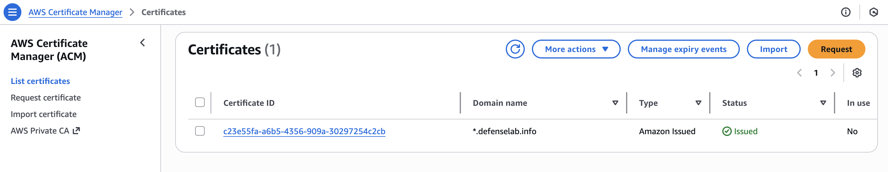
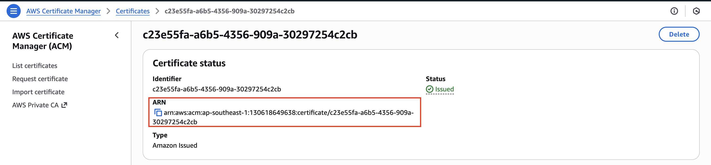

# Triển khai AWS ALB Ingress Controller
## ĐƯA ARGOCD PUBLIC RA NGOÀI THÔNG QUA ALB INGRESS
Để triển khai AWS Load Balancer Controller và Ingress cho ArgoCD. Chúng ta sẽ đi theo quy trình “Cài đặt – Kích hoạt”.

```bash
Mục tiêu: Truy cập ArgoCD qua đường dẫn Load Balancer (ALB) chuẩn Production.
Cụm Cluster: tuongpx-lab-cluster
Region: ap-southeast-1
```
## GIAI ĐOẠN 1: CHUẨN BỊ MÔI TRƯỜNG (PREREQUISITES)

### Bước 0: Đảm bảo rằng bạn đã setup xong wildcard ssl trong Cert Manager



Bạn xem thêm bài hướng dẫn về Cert Manager trong EKS [tại đây](https://github.com/tuongpx/master-cicd/tree/master/aws/eks).\
Tại Cert Manager bạn sẽ lấy ARN để chuẩn bị cho phần lab bên dưới.



### Bước 1: Kích hoạt OIDC (Cầu nối bảo mật)

```bash
eksctl utils associate-iam-oidc-provider --cluster tuongpx-lab-cluster --region ap-southeast-1 --approve
```