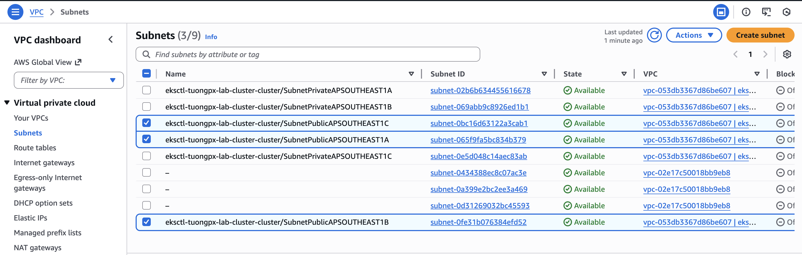
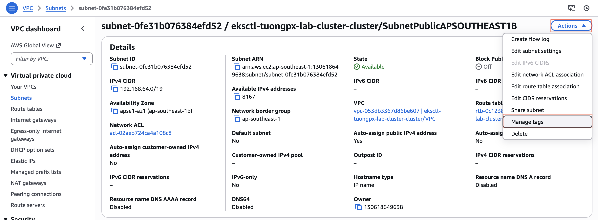
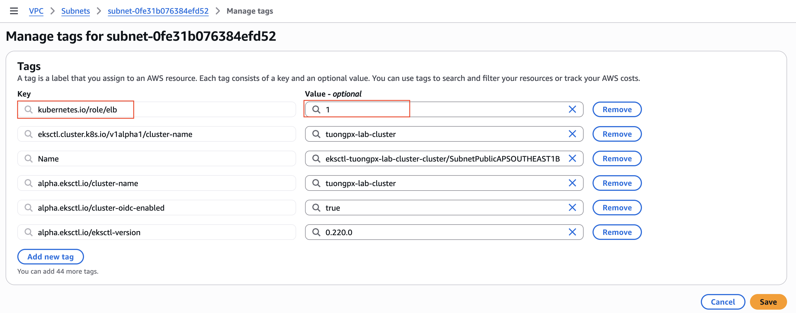

# Triển khai AWS ALB Ingress Controller
## ĐƯA ARGOCD PUBLIC RA NGOÀI THÔNG QUA ALB INGRESS
Để triển khai AWS Load Balancer Controller và Ingress cho ArgoCD. Chúng ta sẽ đi theo quy trình “Cài đặt – Kích hoạt”.

```bash
Mục tiêu: Truy cập ArgoCD qua đường dẫn Load Balancer (ALB) chuẩn Production.
Cụm Cluster: tuongpx-lab-cluster
Region: ap-southeast-1
```
## GIAI ĐOẠN 1: CHUẨN BỊ MÔI TRƯỜNG (PREREQUISITES)

### Bước 0: Đảm bảo rằng bạn đã setup xong wildcard ssl trong Cert Manager


Bạn xem thêm bài hướng dẫn về Cert Manager trong EKS [tại đây](https://github.com/tuongpx/master-cicd/tree/master/aws/eks).\
Tại Cert Manager bạn sẽ lấy ARN để chuẩn bị cho phần lab bên dưới.


### Bước 1: Kích hoạt OIDC (Cầu nối bảo mật)

```bash
eksctl utils associate-iam-oidc-provider --cluster tuongpx-lab-cluster --region ap-southeast-1 --approve
```

### Bước 2: Gắn Tag cho Subnet Public (BẮT BUỘC)

1. Vào AWS Console -> VPC -> Subnets.
2. Tìm 2 Subnet Public của Cluster. Ở đây 2 subnet của mình lần lượt là
- eksctl-tuongpx-lab-cluster-cluster/SubnetPublicAPSOUTHEAST1A
- eksctl-tuongpx-lab-cluster-cluster/SubnetPublicAPSOUTHEAST1B
- eksctl-tuongpx-lab-cluster-cluster/SubnetPublicAPSOUTHEAST1C



3. Vào tab Tags, đảm bảo CẢ 3 Subnet đều có tag sau:
    - Key: `kubernetes.io/role/elb`
    - Value: `1`

Bạn Click chọn  Subnet ID của subnet đó > Bấm Action > Manage tags


Sau đó bạn kiểm tra xem đã có tag `kubernetes.io/role/elb` với `Value: 1` chưa. Nếu chưa có thì bấm và Add New tag và add tag đó vào. Như ở bên dưới mình đã add tag rồi.


