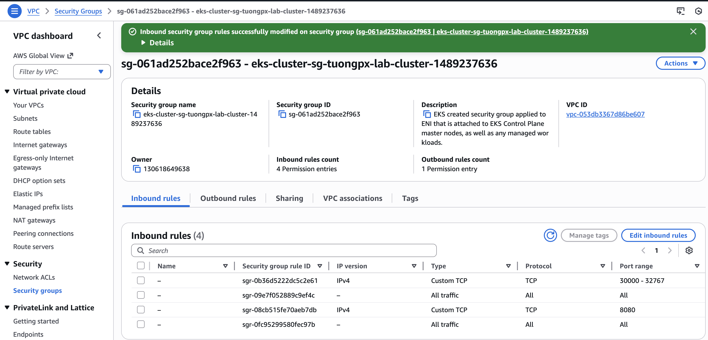
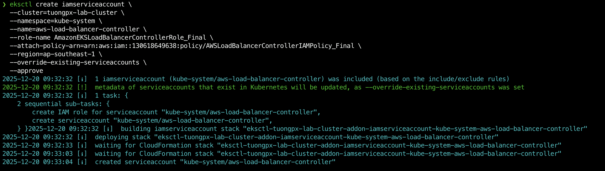
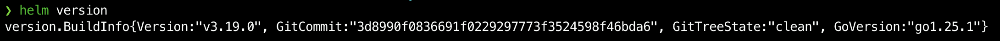
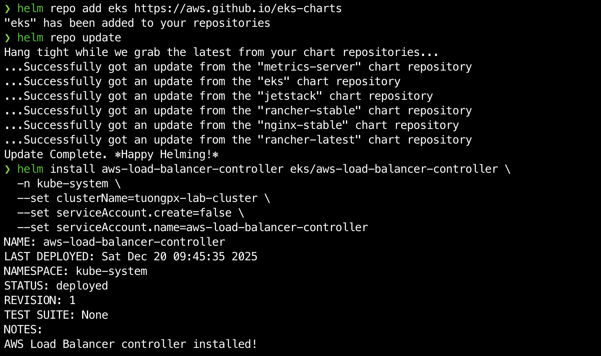
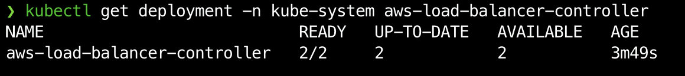

# Triển khai AWS ALB Ingress Controller
## ĐƯA ARGOCD PUBLIC RA NGOÀI THÔNG QUA ALB INGRESS
Để triển khai AWS Load Balancer Controller và Ingress cho ArgoCD. Chúng ta sẽ đi theo quy trình “Cài đặt – Kích hoạt”.

```bash
Mục tiêu: Truy cập ArgoCD qua đường dẫn Load Balancer (ALB) chuẩn Production.
Cụm Cluster: tuongpx-lab-cluster
Region: ap-southeast-1
```
## GIAI ĐOẠN 1: CHUẨN BỊ MÔI TRƯỜNG (PREREQUISITES)

### Bước 0: Đảm bảo rằng bạn đã setup xong wildcard ssl trong Cert Manager


Bạn xem thêm bài hướng dẫn về Cert Manager trong EKS [tại đây](https://github.com/tuongpx/master-cicd/tree/master/aws/eks).\
Tại Cert Manager bạn sẽ lấy ARN để chuẩn bị cho phần lab bên dưới.


### Bước 1: Kích hoạt OIDC (Cầu nối bảo mật)

```bash
eksctl utils associate-iam-oidc-provider --cluster tuongpx-lab-cluster --region ap-southeast-1 --approve
```

### Bước 2: Gắn Tag cho Subnet Public (BẮT BUỘC)

1. Vào AWS Console -> VPC -> Subnets.
2. Tìm 2 Subnet Public của Cluster. Ở đây 2 subnet của mình lần lượt là
- eksctl-tuongpx-lab-cluster-cluster/SubnetPublicAPSOUTHEAST1A
- eksctl-tuongpx-lab-cluster-cluster/SubnetPublicAPSOUTHEAST1B
- eksctl-tuongpx-lab-cluster-cluster/SubnetPublicAPSOUTHEAST1C


3. Vào tab Tags, đảm bảo CẢ 3 Subnet đều có tag sau:
    - Key: `kubernetes.io/role/elb`
    - Value: `1`

Bạn Click chọn  Subnet ID của subnet đó > Bấm Action > Manage tags


Sau đó bạn kiểm tra xem đã có tag `kubernetes.io/role/elb` với `Value: 1` chưa. Nếu chưa có thì bấm và Add New tag và add tag đó vào. Như ở bên dưới mình đã add tag rồi.


### Bước 4: Đảm bảo rằng Security group trong EC2 đã được set cho phép port 8080 truy cập từ 0.0.0.0



## GIAI ĐOẠN 2: THIẾT LẬP QUYỀN HẠN (IAM & SERVICE ACCOUNT)

### Bước 1: Tải Policy Chuẩn Mới Nhất

Mở Terminal lên và chạy lệnh sau:

```bash
curl -O https://raw.githubusercontent.com/kubernetes-sigs/aws-load-balancer-controller/main/docs/install/iam_policy.json
```

### Bước 2: Tạo IAM Policy:

```bash
aws iam create-policy --policy-name AWSLoadBalancerControllerIAMPolicy_Final --policy-document file://iam_policy.json
```
Kết quả sẽ như dưới đây:

```bash
{
    "Policy": {
        "PolicyName": "AWSLoadBalancerControllerIAMPolicy_Final",
        "PolicyId": "ANPAR42L2NQTA5KNGBZRF",
        "Arn": "arn:aws:iam::130618649638:policy/AWSLoadBalancerControllerIAMPolicy_Final",
        "Path": "/",
        "DefaultVersionId": "v1",
        "AttachmentCount": 0,
        "PermissionsBoundaryUsageCount": 0,
        "IsAttachable": true,
        "CreateDate": "2025-12-20T02:27:52+00:00",
        "UpdateDate": "2025-12-20T02:27:52+00:00"
    }
}
```

👉 QUAN TRỌNG: Copy dòng Arn trong kết quả trả về.
(Ví dụ: arn:aws:iam::241688915712:policy/AWSLoadBalancerControllerIAMPolicy_Final)

### Bước 3: Tạo Service Account (Kết nối vào K8s)

Thay ARN_POLICY_CUA_BAN bằng chuỗi ARN vừa copy ở trên.

```bash
eksctl create iamserviceaccount \
  --cluster=tuongpx-lab-cluster \
  --namespace=kube-system \
  --name=aws-load-balancer-controller \
  --role-name AmazonEKSLoadBalancerControllerRole_Final \
  --attach-policy-arn=ARN_POLICY_CUA_BAN \
  --region=ap-southeast-1 \
  --override-existing-serviceaccounts \
  --approve
```
(Lưu ý: Thay số 130618649638 trong ARN bằng số Account ID của bạn mà bạn vừa lấy ở lệnh trên). Với tài khoản của tôi ID là 130618649638.\

Vậy nên code đầy đủ sẽ là:
```bash
eksctl create iamserviceaccount \
  --cluster=tuongpx-lab-cluster \
  --namespace=kube-system \
  --name=aws-load-balancer-controller \
  --role-name AmazonEKSLoadBalancerControllerRole_Final \
  --attach-policy-arn=arn:aws:iam::130618649638:policy/AWSLoadBalancerControllerIAMPolicy_Final \
  --region=ap-southeast-1 \
  --override-existing-serviceaccounts \
  --approve
```



## GIAI ĐOẠN 3: CÀI ĐẶT CONTROLLER (HELM)

### Bước 1: Để chuẩn bị cho bước này ta phải cài helm trước:

```bash
$ curl -fsSL -o get_helm.sh https://raw.githubusercontent.com/helm/helm/main/scripts/get-helm-4
$ chmod 700 get_helm.sh
$ ./get_helm.sh
```
Kiểm tra lại xem helm đã được cài đặt thành công chưa với câu lệnh `helm version`



### Bước 2: Thêm kho chứa (Repo) và cài đặt Controller bằng HELM:

```bash
helm repo add eks https://aws.github.io/eks-charts
helm repo update

helm install aws-load-balancer-controller eks/aws-load-balancer-controller \
  -n kube-system \
  --set clusterName=tuongpx-lab-cluster \
  --set serviceAccount.create=false \
  --set serviceAccount.name=aws-load-balancer-controller
```


### Bước 3. Kiểm tra xem nó sống chưa:

```bash
kubectl get deployment -n kube-system aws-load-balancer-controller
```


## GIAI ĐOẠN 4: KÍCH HOẠT INGRESS (DEPLOY)

### Bước 1: Tạo file argocd-ingress.yaml
Nội dung chuẩn (Layer 7, HTTP 80 -> Backend HTTPS 443)
```bash
apiVersion: networking.k8s.io/v1
kind: Ingress
metadata:
  name: argocd-server-ingress
  namespace: argocd
  annotations:
    # 1. Controller Designation
    # Specifies that this Ingress is managed by the AWS Load Balancer Controller.
    kubernetes.io/ingress.class: alb

    # 2. Network Scheme
    # 'internet-facing': Creates a public Load Balancer accessible from the internet.
    # 'internal': Creates a private Load Balancer (internal VPC only).
    alb.ingress.kubernetes.io/scheme: internet-facing

    # 3. Target Type
    # 'ip': Routes traffic directly to the Pod IP (High Performance & Faster).
    # 'instance': Routes traffic to NodePort (Legacy mode).
    alb.ingress.kubernetes.io/target-type: ip

    # --- SSL/HTTPS CONFIGURATION ---
    
    # 4. ACM Certificate
    # ACTION REQUIRED: Replace the ARN below with your actual Certificate ARN from AWS ACM.
    alb.ingress.kubernetes.io/certificate-arn: arn:aws:acm:ap-southeast-1:241688915712:certificate/70c58476-9a59-4bdc-b1df-cca71c88963a

    # 5. Listen Ports
    # Configures the Load Balancer to listen on both HTTP (80) and HTTPS (443).
    alb.ingress.kubernetes.io/listen-ports: '[{"HTTP": 80}, {"HTTPS":443}]'

    # 6. SSL Redirection
    # Automatically redirects all HTTP traffic to HTTPS for security.
    alb.ingress.kubernetes.io/actions.ssl-redirect: '{"Type": "redirect", "RedirectConfig": { "Protocol": "HTTPS", "Port": "443", "StatusCode": "HTTP_301"}}'

    # --- BACKEND PROTOCOL (CRITICAL FOR ARGOCD) ---
    
    # 7. Backend Protocol
    # We use 'HTTP' here because we have disabled internal HTTPS on the ArgoCD Pod 
    # (using the --insecure flag) to avoid "Login Loop" issues and simplify SSL termination.
    alb.ingress.kubernetes.io/backend-protocol: HTTPS

    # 8. Health Check Settings
    # Since the backend speaks HTTP, the health check must also use HTTP.
    alb.ingress.kubernetes.io/healthcheck-protocol: HTTPS
    # ArgoCD exposes a specific health check endpoint at /healthz.
    alb.ingress.kubernetes.io/healthcheck-path: /healthz
    # Codes considered "Healthy" by the Load Balancer.
    alb.ingress.kubernetes.io/success-codes: '200'

spec:
  # Standard Ingress Class definition
  ingressClassName: alb
  rules:
    - http:
        paths:
          - path: /
            pathType: Prefix
            backend:
              service:
                name: argocd-server
                port:
                  # This must match the HTTP port exposed by the argocd-server Service.
                  number: 80
```


