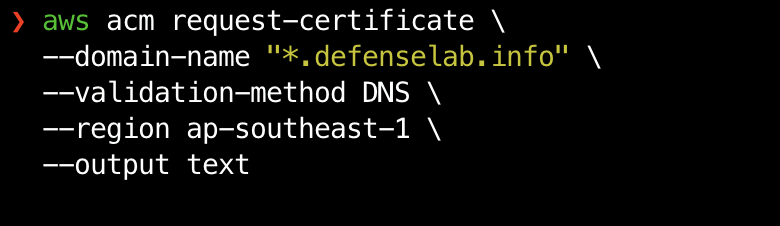
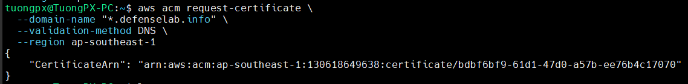
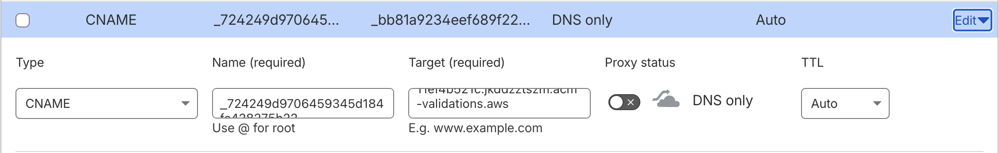

# LAB03: Triển khai Cert Manager trên EKS

## TẠO & XÁC THỰC ACM SSL BẰNG AWS CLI

### 🎯 Mục tiêu:

- Dùng lệnh để xin chứng chỉ Wildcard *.defenselab.info.
- Dùng lệnh để lấy thông tin CNAME (Name & Value).
- Mang sang Cloudflare cấu hình.

### BƯỚC 1: GỬI YÊU CẦU (REQUEST CERTIFICATE)
Chạy lệnh sau để yêu cầu AWS cấp chứng chỉ cho miền của bạn tại Singapore (ap-southeast-1).

```bash
aws acm request-certificate \
  --domain-name "*.defenselab.info" \
  --validation-method DNS \
  --region ap-southeast-1 \
  --output text
```

👉 KẾT QUẢ: Nó sẽ trả về một dòng ARN duy nhất (Ví dụ: arn:aws:acm:ap-southeast-1:241688915712:certificate/xxxx...).
Hãy Copy dòng ARN đó lại ngay.




### BƯỚC 2: LẤY THÔNG TIN CNAME ĐỂ XÁC THỰC
Sau khi request, AWS mất khoảng vài giây để sinh ra cái CNAME ngẫu nhiên. Chúng ta thay cái ARN_CUA_BAN vào lệnh dưới đây để lấy thông tin:

```bash
aws acm describe-certificate \
  --certificate-arn arn:aws:acm:ap-southeast-1:130618649638:certificate/b04f0956-f3bf-4ddc-af7f-04eac4b1be03 \
  --region ap-southeast-1 \
  --query "Certificate.DomainValidationOptions[0].ResourceRecord"
```

Kết quả trả về sẽ là một cục JSON như thế này:

```bash
{
    "Name": "_724249d9706459345d184fa428275b22.defenselab.info.",
    "Type": "CNAME",
    "Value": "_bb81a9234eef689f22e2eb11ef4b521c.jkddzztszm.acm-validations.aws."
}
```

👉 Nhiệm vụ: Copy cái Name và Value đó.

### BƯỚC 3: CẤU HÌNH TRÊN CLOUDFLARE (THỦ CÔNG)

Bước này bắt buộc phải làm trên giao diện Cloudflare (trừ khi bạn dùng API Cloudflare, nhưng làm Web cho nhanh).\

    - Vào Cloudflare DNS
    - Add Record:

```bash
Type: CNAME
Name: Dán cái Name ở bước 2 vào (Bỏ đuôi .defenselab.info đi).
Target: Dán cái Value ở bước 2 vào.
Proxy Status: ☁️ TẮT (DNS Only / Xám) <— BẮT BUỘC.
```
    - Save


### BƯỚC 4: KIỂM TRA TRẠNG THÁI (NGHIỆM THU)
Sau khi add bên Cloudflare xong, đợi 1-2 phút rồi chạy lệnh này để xem AWS đã xác nhận chưa:

```bash
aws acm describe-certificate \
  --certificate-arn arn:aws:acm:ap-southeast-1:130618649638:certificate/b04f0956-f3bf-4ddc-af7f-04eac4b1be03 \
  --region ap-southeast-1 \
  --query "Certificate.Status"
```
⏳ Nếu thấy hiện: "PENDING_VALIDATION" -> Đợi thêm chút nữa.

✅ Nếu thấy hiện: "ISSUED" -> THÀNH CÔNG!

