# LAB 1: Tạo cụm EKS
## Chuẩn bị:
- Một tài khoản AWS Trial có sẵn 100 credit
- Các thành phần lab
    - I. Tạo IAM và Access Key.
    - II. Cài AWS CLI, EKSCTL, KUBECTL
    - III. Tiến hành cài đặt EKS

## I. Tạo IAM và Access Key
### 1. Tạo IAM
- Bước 1: Tạo IAM để truy cập cli lẫn web console.
    - Sau khi tạo user vào phần search gõ IAM và click chọn IAM

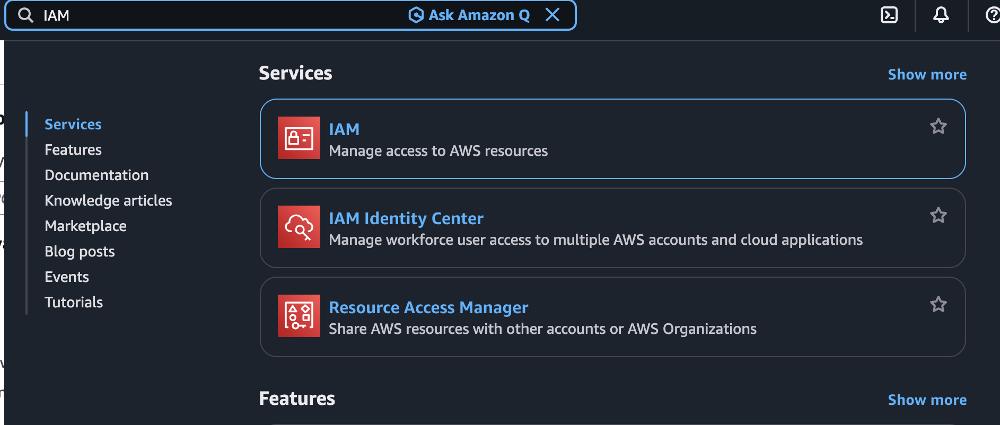

- Bước 2: Tạo user:
    - Tại IAM bạn click vào Users sau đó bấm Create user

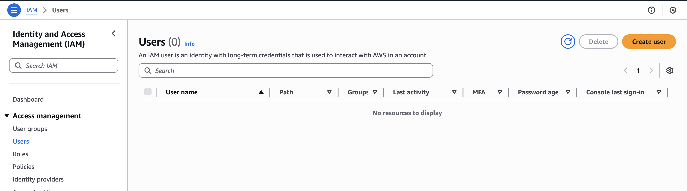

- Bước 3: Tại hộp thoại tạo user:
    - User name bạn gõ user. lưu ý không gõ ký tự đặc biệt chỉ gõ ký tự thường.
    - Sau đó bạn click vào Provide user access to AWS Management Console: ở đây bạn chọn tick vào để có quyền truy cập console trên web management của AWS
    - Phần Console password bạn chọn Custom password và gõ mật khẩu vào.
    - Lưu ý từ phiên bản 2025 về sau việc tạo AWS access key sẽ không tạo lúc tạo user mà sẽ tạo sau khi tạo user xong.
    - Sau đó bấm Next để qua bước Set permissions.

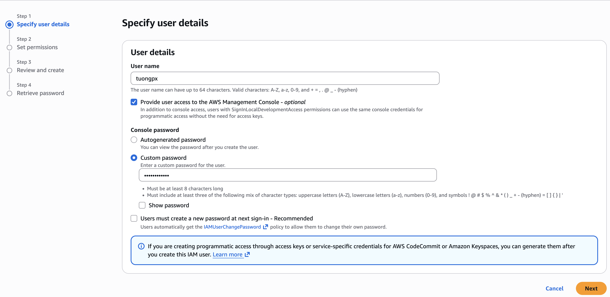

- Bước 4: Tại đây ta click chọn Attach policy dirrectly và chọn Administrator
```bash
Tại sao AWS lại đưa ra 3 lựa chọn? Khi nào dùng cái nào? Hãy cùng phân tích sơ đồ tư duy dưới đây:

1. Add user to group (Thêm vào nhóm) – Chuẩn mực doanh nghiệp
Đây là lựa chọn Best Practice (Thực hành tốt nhất) cho môi trường thực tế.

Tư duy: Hãy tưởng tượng bạn quản lý một công ty có 50 kỹ sư DevOps. Nếu bạn đi gắn quyền cho từng người một, việc quản lý sẽ trở nên hỗn loạn. Thay vào đó, bạn tạo một “Phòng ban ảo” (Group) tên là DevOps-Team và gắn quyền cho Group này.
Ưu điểm: Khả năng mở rộng (Scalability).
Nhân viên mới vào? Chỉ cần thêm vào Group DevOps-Team là tự động có đủ quyền.
Nhân viên nghỉ việc? Xóa khỏi Group là xong.
2. Copy permissions (Sao chép quyền) – Người thừa kế
Tư duy: Dùng cho tình huống bàn giao công việc. Ví dụ: Nhân viên A nghỉ việc, Nhân viên B vào thay thế đúng vị trí đó.
Hành động: Thay vì phải nhớ A từng có những quyền gì, bạn chọn chức năng này để “Clone” (nhân bản) y hệt quyền của A sang cho B. Nhanh chóng và chính xác.
3. Attach policies directly (Gắn trực tiếp) – Lựa chọn cho Lab/Admin
Đây là lựa chọn chúng ta sử dụng trong bài học này.

Tư duy: Dành cho các trường hợp “cá biệt” hoặc “siêu quyền lực”. Thường dùng cho tài khoản Root, tài khoản Admin tổng, hoặc môi trường Lab/Test nhanh gọn.
Tại sao chọn AdministratorAccess cho bài học này?
Policy này chứa một đoạn mã JSON quyền lực nhất AWS:

{
    "Effect": "Allow",
    "Action": "*",
    "Resource": "*"
}

Ý nghĩa: “Cho phép (Allow) thực hiện mọi hành động (Action: *) trên mọi tài nguyên (Resource: *).”
Lý do sư phạm: Khi triển khai EKS, hệ thống sẽ tự động gọi đến hàng chục dịch vụ khác nhau (VPC, EC2, ELB, IAM Role…). Nếu không cấp quyền Admin, học viên sẽ liên tục gặp lỗi “Access Denied” (Từ chối truy cập), gây gián đoạn quá trình học tập.
```
```bash
⚠️ CẢNH BÁO BẢO MẬT: Trong môi trường Production (Chạy thật), TUYỆT ĐỐI HẠN CHẾ dùng Attach policies directly với quyền AdministratorAccess cho nhân viên thường. Hãy luôn tuân thủ nguyên tắc “Least Privilege” (Đặc quyền tối thiểu – chỉ cấp vừa đủ quyền để làm việc).
```
– Sau Đó bạn kéo xuống cuối trang và bấm Next

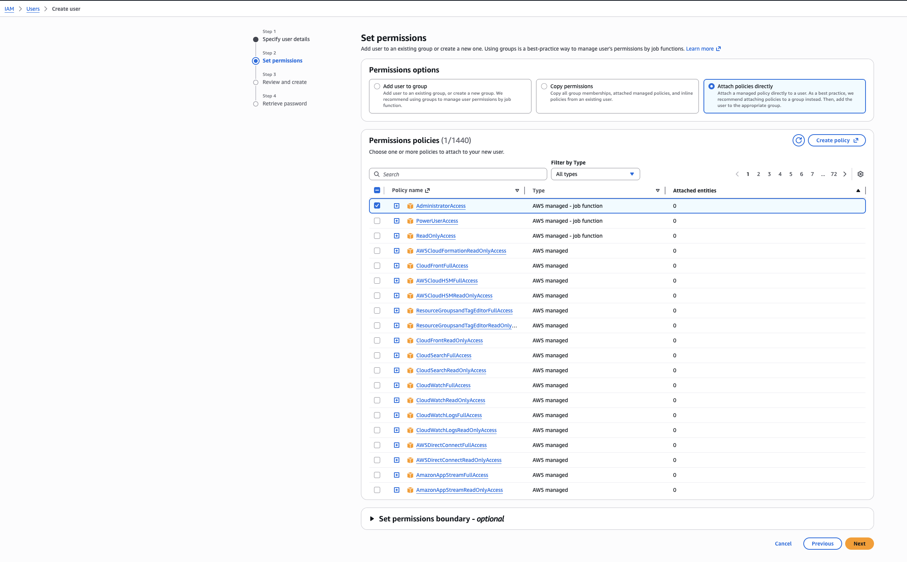

- Bước 5: Tại phần Review and create bấm Create user

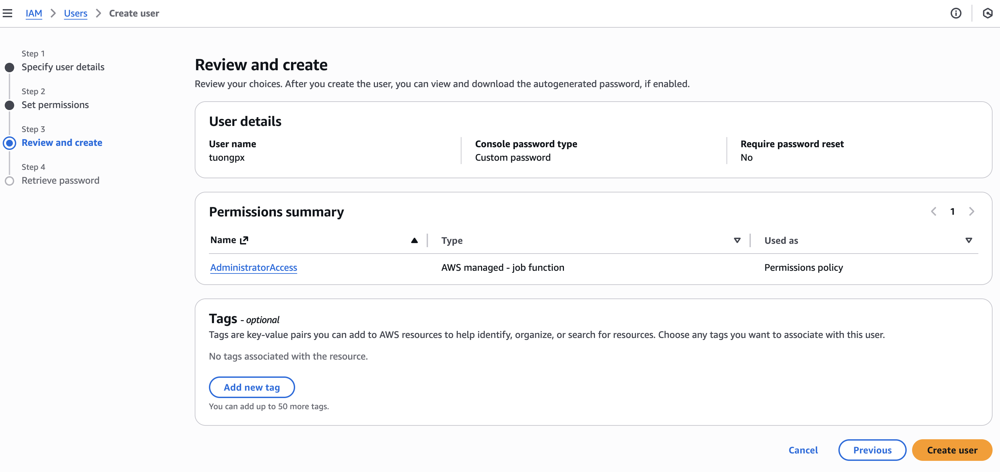

- Bước 6: Sau đó bấm Return to users list

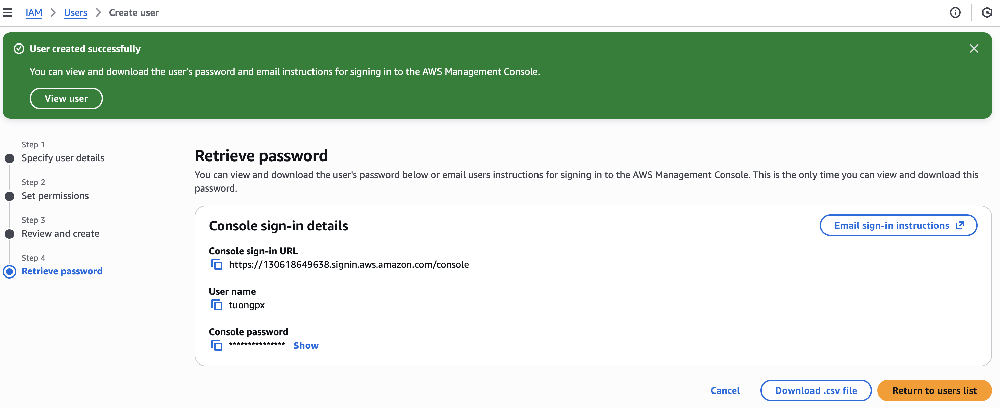

- Bước 7: Và tại đây ta sẽ thây user đã được tạo thành công.

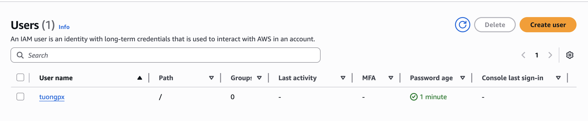

### 2. Tạo Access Key
- Bước 1: Tại Users bạn click chuột trái vào user bạn muốn tạo access key.


- Bước 2: Tại hộp thoại detail của user ta click và Create access key

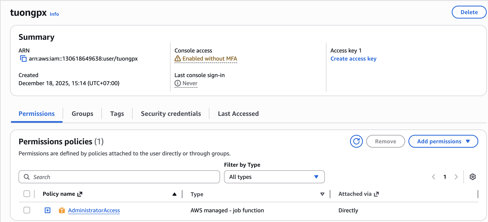

- Bước 3: Tại đây ta chọn Option đầu tiên là Command Line Interface (CLI). Sau đó bấm Next.

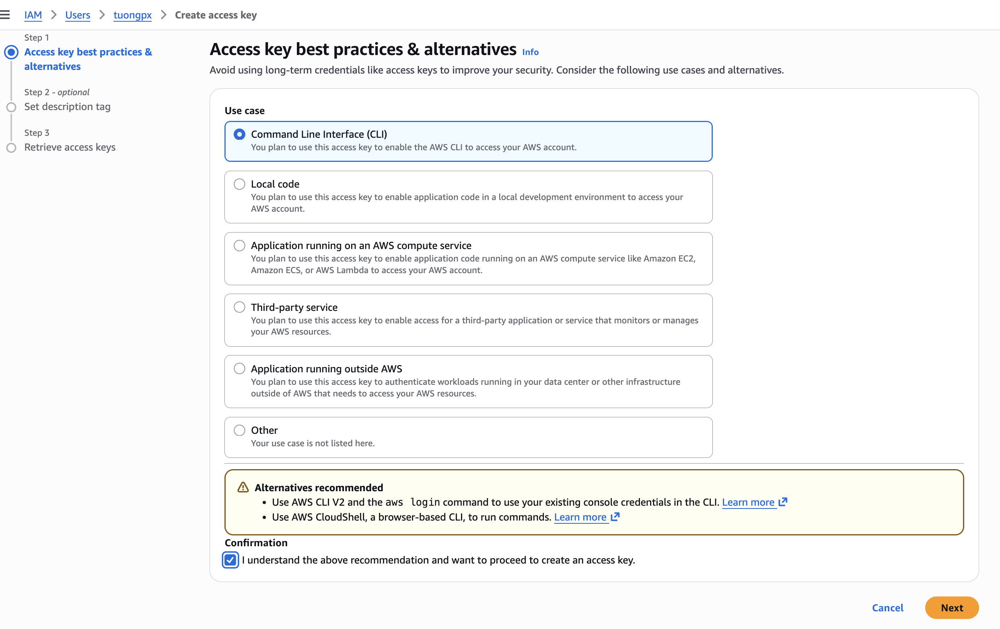

```bash
Giải thích về các Option
Option 1: Command Line Interface (CLI) – (Cái chúng ta chọn)
Dành cho ai: Dành cho Kỹ sư/Lập trình viên ngồi tại máy tính cá nhân (Laptop) muốn chạy lệnh aws, kubectl, terraform.
Bản chất: Máy tính cá nhân nằm ngoài AWS, nên cần “chìa khóa” (Access Key) để mở cửa vào AWS.
Option 2: Local code
Dành cho ai: Dành cho việc viết code (Python, Java, Node.js…) chạy trên máy local.
Khác gì CLI? Về mặt kỹ thuật, nó vẫn tạo ra Access Key y hệt option 1. AWS chỉ chia ra để thống kê mục đích sử dụng.
Option 3: Application running on an AWS compute service
Dành cho ai: Ứng dụng chạy trên EC2, Lambda, ECS…
LỜI KHUYÊN CỐT TỬ :
Tuyệt đối KHÔNG chọn cái này. Nếu ứng dụng của bạn chạy trên server của AWS (ví dụ EC2), đừng bao giờ tạo Access Key rồi copy vào trong server đó.

Giải pháp đúng: Hãy dùng IAM Role. Gán Role cho con EC2. Con EC2 sẽ tự động có quyền mà không cần lưu trữ bất kỳ file text chứa mật khẩu nào. Đây là nguyên tắc bảo mật số 1 trên Cloud.

Option 4: Third-party service
Dành cho ai: Khi bạn dùng các công cụ bên ngoài không thuộc AWS (ví dụ: GitHub Actions, CircleCI, Terraform Cloud) cần truy cập vào AWS để deploy.
Option 5: Application running outside AWS
Dành cho ai: Đây chính là trường hợp On-premise (Máy chủ vật lý tại công ty) hoặc các hệ thống Hybrid Cloud.
Ví dụ: Sau này khi Tony cài Jenkins trên server ở nhà (hoặc công ty), Tony sẽ tạo một Access Key khác và chọn option này. Nó giúp phân biệt key nào dùng cho Laptop cá nhân, key nào dùng cho Server sản xuất.
Option 6: Other
Các trường hợp không xác định khác.
```
```bash
TỔNG KẾT
“Các bạn hãy nhớ nguyên tắc:

Người/Máy ngoài AWS (Laptop, On-premise): Bắt buộc dùng IAM Access Key.
Máy trong AWS (EC2, Lambda): Bắt buộc dùng IAM Role. Tuyệt đối không nhét Access Key vào EC2.”
```
- Bước 4: Phần description tag bạn gõ description cho access key và bấm Create access key


- Bước 5: Ta copy Access key và Secret access key ra lưu lại ở keepass để khi cần dùng cho tiện và an toàn.

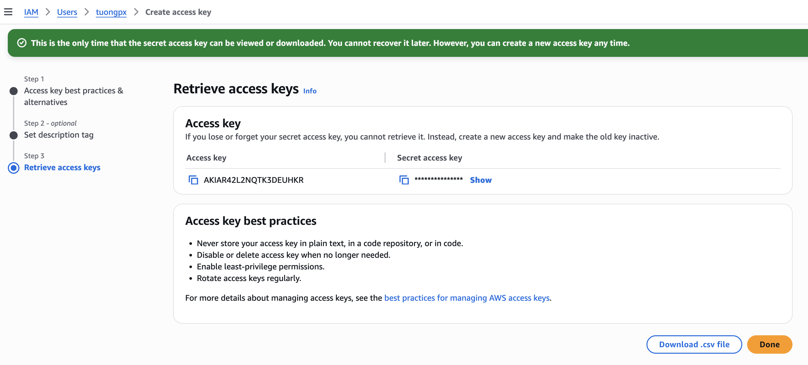

## II. Cài đặt các thành phần.
### 1. Cài đặt AWS CLI
```bash
# Linux
curl "https://awscli.amazonaws.com/awscli-exe-linux-x86_64.zip" -o "awscliv2.zip"
unzip awscliv2.zip
sudo ./aws/install

# macOS (via Homebrew)
brew install awscli

# Windows (PowerShell)
msiexec.exe /i https://awscli.amazonaws.com/AWSCLIV2.msi
```
- Sau khi cài xong kiểm tra lại phiên bản của aws cli:

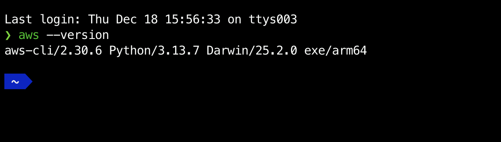

- Cấu hình thông số cho AWS CLI Profile

```bash
aws configure
```
```bash
- Và tiến hãnh gõ access key và secret đã lưu vào

- Default region name ta gõ: ap-southeast-1

- Default output format ta gõ : json
```
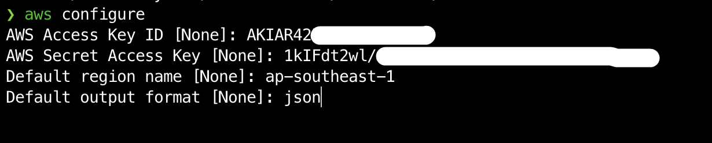

- Sau khi xong hết ta tiến hành test lại 1 lượt bằng lệnh

```bash
aws sts get-caller-identity (Xác nhận lại kết nối)
kubectl version --client (Xác nhận đã có kubectl)
eksctl version (Xác nhận đã có eksctl)
```
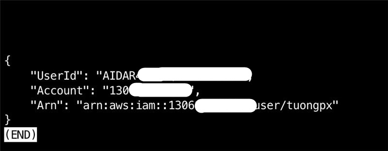


