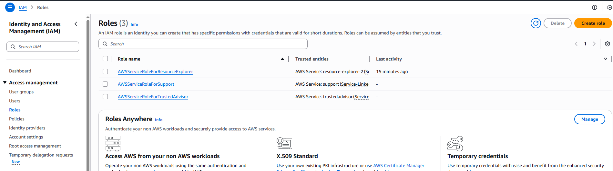
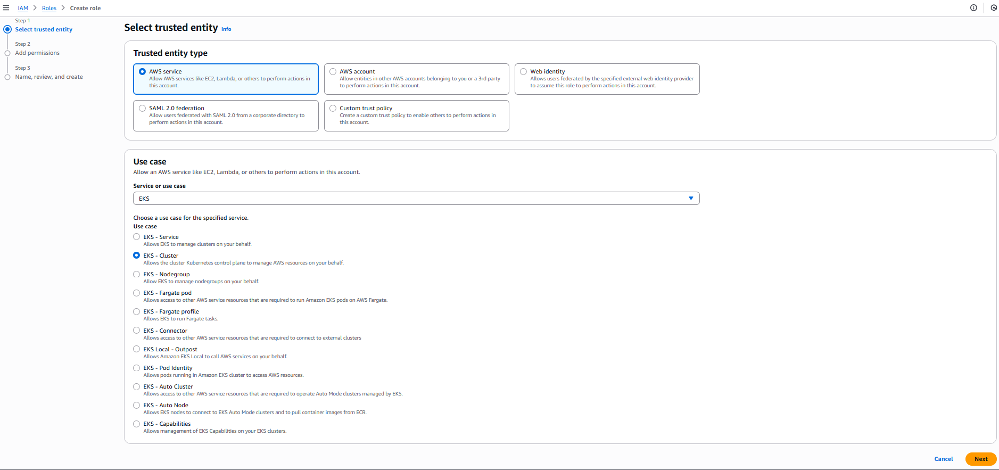
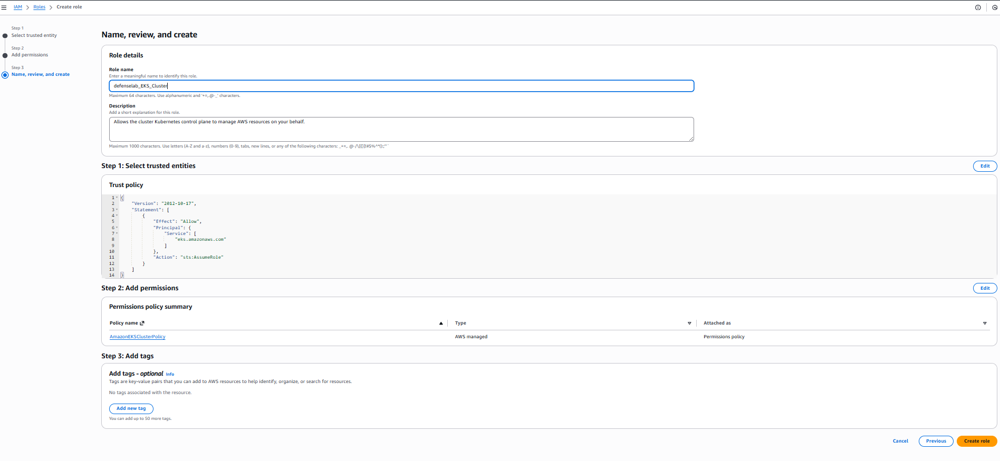
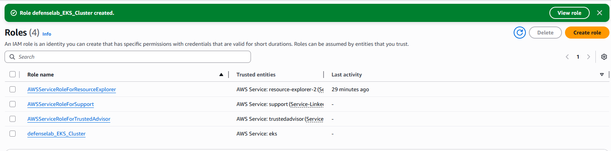
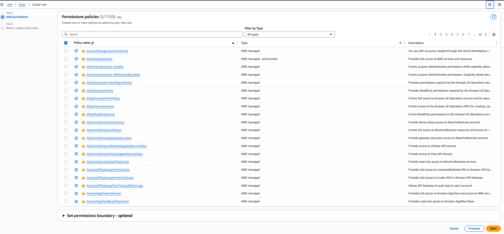
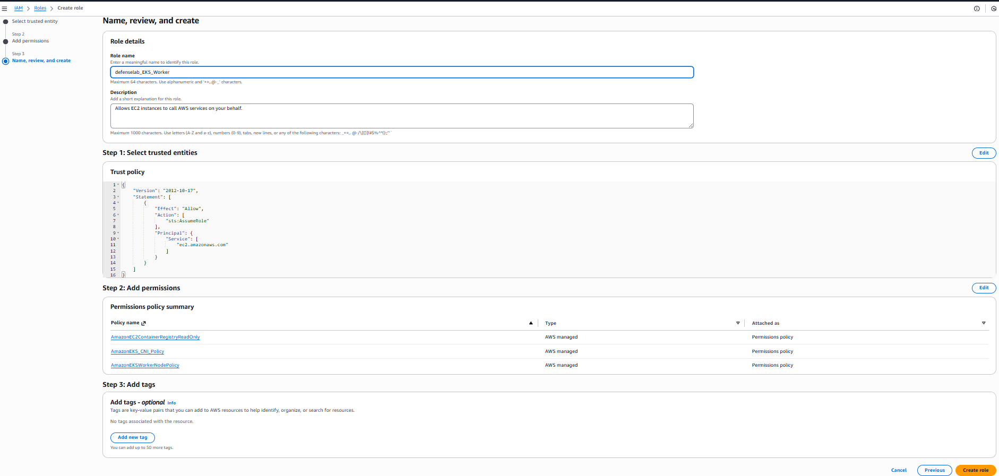
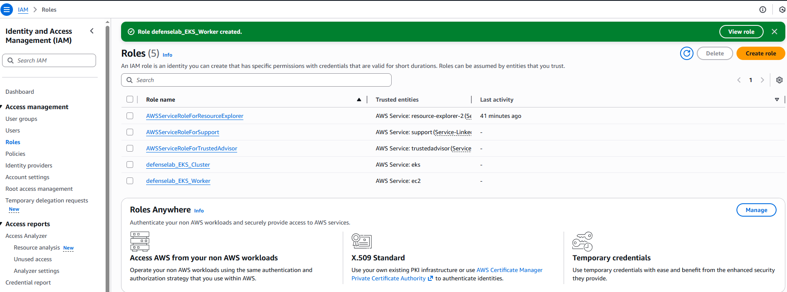
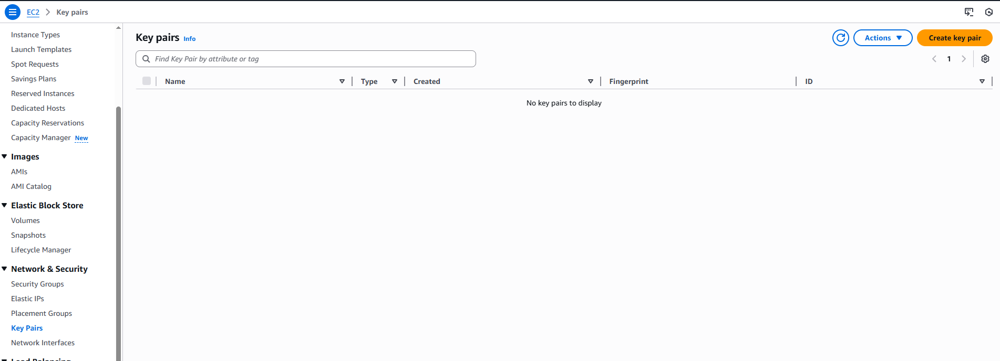
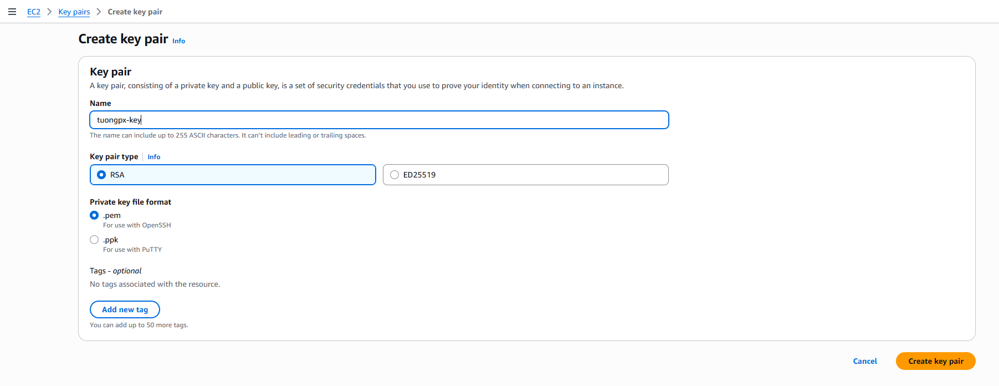

# LAB 1: Tạo cụm EKS
## Chuẩn bị:
- Một tài khoản AWS Trial có sẵn 100 credit
- Các thành phần lab
    - I. Tạo IAM và Access Key.
    - II. Cài AWS CLI, EKSCTL, KUBECTL
    - III. Tiến hành cài đặt EKS

## I. Tạo IAM và Access Key
### 1. Tạo IAM
- Bước 1: Tạo IAM để truy cập cli lẫn web console.
    - Sau khi tạo user vào phần search gõ IAM và click chọn IAM


- Bước 2: Tạo user:
    - Tại IAM bạn click vào Users sau đó bấm Create user


- Bước 3: Tại hộp thoại tạo user:
    - User name bạn gõ user. lưu ý không gõ ký tự đặc biệt chỉ gõ ký tự thường.
    - Sau đó bạn click vào Provide user access to AWS Management Console: ở đây bạn chọn tick vào để có quyền truy cập console trên web management của AWS
    - Phần Console password bạn chọn Custom password và gõ mật khẩu vào.
    - Lưu ý từ phiên bản 2025 về sau việc tạo AWS access key sẽ không tạo lúc tạo user mà sẽ tạo sau khi tạo user xong.
    - Sau đó bấm Next để qua bước Set permissions.


- Bước 4: Tại đây ta click chọn Attach policy dirrectly và chọn Administrator
```bash
Tại sao AWS lại đưa ra 3 lựa chọn? Khi nào dùng cái nào? Hãy cùng phân tích sơ đồ tư duy dưới đây:

1. Add user to group (Thêm vào nhóm) – Chuẩn mực doanh nghiệp
Đây là lựa chọn Best Practice (Thực hành tốt nhất) cho môi trường thực tế.

Tư duy: Hãy tưởng tượng bạn quản lý một công ty có 50 kỹ sư DevOps. Nếu bạn đi gắn quyền cho từng người một, việc quản lý sẽ trở nên hỗn loạn. Thay vào đó, bạn tạo một “Phòng ban ảo” (Group) tên là DevOps-Team và gắn quyền cho Group này.
Ưu điểm: Khả năng mở rộng (Scalability).
Nhân viên mới vào? Chỉ cần thêm vào Group DevOps-Team là tự động có đủ quyền.
Nhân viên nghỉ việc? Xóa khỏi Group là xong.
2. Copy permissions (Sao chép quyền) – Người thừa kế
Tư duy: Dùng cho tình huống bàn giao công việc. Ví dụ: Nhân viên A nghỉ việc, Nhân viên B vào thay thế đúng vị trí đó.
Hành động: Thay vì phải nhớ A từng có những quyền gì, bạn chọn chức năng này để “Clone” (nhân bản) y hệt quyền của A sang cho B. Nhanh chóng và chính xác.
3. Attach policies directly (Gắn trực tiếp) – Lựa chọn cho Lab/Admin
Đây là lựa chọn chúng ta sử dụng trong bài học này.

Tư duy: Dành cho các trường hợp “cá biệt” hoặc “siêu quyền lực”. Thường dùng cho tài khoản Root, tài khoản Admin tổng, hoặc môi trường Lab/Test nhanh gọn.
Tại sao chọn AdministratorAccess cho bài học này?
Policy này chứa một đoạn mã JSON quyền lực nhất AWS:

{
    "Effect": "Allow",
    "Action": "*",
    "Resource": "*"
}

Ý nghĩa: “Cho phép (Allow) thực hiện mọi hành động (Action: *) trên mọi tài nguyên (Resource: *).”
Lý do sư phạm: Khi triển khai EKS, hệ thống sẽ tự động gọi đến hàng chục dịch vụ khác nhau (VPC, EC2, ELB, IAM Role…). Nếu không cấp quyền Admin, học viên sẽ liên tục gặp lỗi “Access Denied” (Từ chối truy cập), gây gián đoạn quá trình học tập.
```
```bash
⚠️ CẢNH BÁO BẢO MẬT: Trong môi trường Production (Chạy thật), TUYỆT ĐỐI HẠN CHẾ dùng Attach policies directly với quyền AdministratorAccess cho nhân viên thường. Hãy luôn tuân thủ nguyên tắc “Least Privilege” (Đặc quyền tối thiểu – chỉ cấp vừa đủ quyền để làm việc).
```
– Sau Đó bạn kéo xuống cuối trang và bấm Next


- Bước 5: Tại phần Review and create bấm Create user


- Bước 6: Sau đó bấm Return to users list


- Bước 7: Và tại đây ta sẽ thây user đã được tạo thành công.


### 2. Tạo Access Key
- Bước 1: Tại Users bạn click chuột trái vào user bạn muốn tạo access key.


- Bước 2: Tại hộp thoại detail của user ta click và Create access key


- Bước 3: Tại đây ta chọn Option đầu tiên là Command Line Interface (CLI). Sau đó bấm Next.


```bash
Giải thích về các Option
Option 1: Command Line Interface (CLI) – (Cái chúng ta chọn)
Dành cho ai: Dành cho Kỹ sư/Lập trình viên ngồi tại máy tính cá nhân (Laptop) muốn chạy lệnh aws, kubectl, terraform.
Bản chất: Máy tính cá nhân nằm ngoài AWS, nên cần “chìa khóa” (Access Key) để mở cửa vào AWS.
Option 2: Local code
Dành cho ai: Dành cho việc viết code (Python, Java, Node.js…) chạy trên máy local.
Khác gì CLI? Về mặt kỹ thuật, nó vẫn tạo ra Access Key y hệt option 1. AWS chỉ chia ra để thống kê mục đích sử dụng.
Option 3: Application running on an AWS compute service
Dành cho ai: Ứng dụng chạy trên EC2, Lambda, ECS…
LỜI KHUYÊN CỐT TỬ :
Tuyệt đối KHÔNG chọn cái này. Nếu ứng dụng của bạn chạy trên server của AWS (ví dụ EC2), đừng bao giờ tạo Access Key rồi copy vào trong server đó.

Giải pháp đúng: Hãy dùng IAM Role. Gán Role cho con EC2. Con EC2 sẽ tự động có quyền mà không cần lưu trữ bất kỳ file text chứa mật khẩu nào. Đây là nguyên tắc bảo mật số 1 trên Cloud.

Option 4: Third-party service
Dành cho ai: Khi bạn dùng các công cụ bên ngoài không thuộc AWS (ví dụ: GitHub Actions, CircleCI, Terraform Cloud) cần truy cập vào AWS để deploy.
Option 5: Application running outside AWS
Dành cho ai: Đây chính là trường hợp On-premise (Máy chủ vật lý tại công ty) hoặc các hệ thống Hybrid Cloud.
Ví dụ: Sau này khi Tony cài Jenkins trên server ở nhà (hoặc công ty), Tony sẽ tạo một Access Key khác và chọn option này. Nó giúp phân biệt key nào dùng cho Laptop cá nhân, key nào dùng cho Server sản xuất.
Option 6: Other
Các trường hợp không xác định khác.
```
```bash
TỔNG KẾT
“Các bạn hãy nhớ nguyên tắc:

Người/Máy ngoài AWS (Laptop, On-premise): Bắt buộc dùng IAM Access Key.
Máy trong AWS (EC2, Lambda): Bắt buộc dùng IAM Role. Tuyệt đối không nhét Access Key vào EC2.”
```
- Bước 4: Phần description tag bạn gõ description cho access key và bấm Create access key


- Bước 5: Ta copy Access key và Secret access key ra lưu lại ở keepass để khi cần dùng cho tiện và an toàn.


## II. Cài đặt các thành phần.
### 1. Cài đặt AWS CLI
```bash
# Linux
curl "https://awscli.amazonaws.com/awscli-exe-linux-x86_64.zip" -o "awscliv2.zip"
unzip awscliv2.zip
sudo ./aws/install

# macOS (via Homebrew)
brew install awscli

# Windows (PowerShell)
msiexec.exe /i https://awscli.amazonaws.com/AWSCLIV2.msi
```
- Sau khi cài xong kiểm tra lại phiên bản của aws cli:


- Cấu hình thông số cho AWS CLI Profile

```bash
aws configure
```
```bash
- Và tiến hãnh gõ access key và secret đã lưu vào

- Default region name ta gõ: ap-southeast-1

- Default output format ta gõ : json
```


- Sau khi xong hết ta tiến hành test lại 1 lượt bằng lệnh

```bash
aws sts get-caller-identity (Xác nhận lại kết nối)
kubectl version --client (Xác nhận đã có kubectl)
eksctl version (Xác nhận đã có eksctl)
```


## III. Cài đặt EKS

### Bước 1: Cài đặt role EKS Cluster cho user tuongpx

- IAM > Access management > Role > Click Create role


- Trust entity type chojn AWS service , Use case chọn EKS- Cluster và bấm Next


- Hộp thoại Add Permission để mặc định như bên dưới và bấm Next


- Hộp Thoại Name, review, and create để đặt tên cho Role  và bấm Create role


- Role đã thành tạo thành công


### Bước 2: TẠO ROLE THỨ 2 (CHO WORKER NODES)

- Role này là giấy phép để các máy tính con (EC2) có quyền nghe lệnh từ Cluster.
    - 1.Bấm nút màu cam Create role (ngay trên màn hình bạn đang đứng).

    - 2.Trusted entity type: Chọn AWS service.

- Service or use case: Lần này KHÔNG chọn EKS.


👉 Chọn: EC2. (Chọn dòng đầu tiên: EC2). và bấm Next

- Add permissions (Bước này quan trọng nhất):  Bạn gõ vào ô tìm kiếm và tick chọn đủ 3 cái này (Có thể tìm từng cái rồi tick, sau đó xóa ô tìm kiếm để tìm cái tiếp theo):
    - AmazonEKSWorkerNodePolicy (Quyền làm công nhân EKS).
    - AmazonEC2ContainerRegistryReadOnly (Quyền tải Docker Image về).
    - AmazonEKS_CNI_Policy (Quyền kết nối mạng IP).


- Bấm Next.

- Role name: Đặt là defenselab_EKS_Worker. Và bấm Create role


- Role đã được tạo xong


### Bước 3: Tạo token cho network

- Trong EC2 > Network & Security > Key Pairs và bấm Create key pair.


- Sau đó tiến hành đặt
    - Name : tên của key nhớ tên này sẽ dùng trong phần script tạo sau này.
    - Key pair tyle chọn RSA
    - Private key file format : .pem
    - Bấm Create key pair để tạo key.


- Key đã được tạo thành công


### Bước 4: Sau khi đã tạo xong Role + Key Pair ta tiến hành dùng eksctl để tạo cụm EKS:

- Tạo file tuongpx-cluster-v1.yaml với nội dung:

```bash
apiVersion: eksctl.io/v1alpha5
kind: ClusterConfig

metadata:
  name: tuongpx-lab-cluster
  region: ap-southeast-1
  version: "1.32"

# =======================================================
# 1. NETWORKING
# =======================================================
vpc:
  # Disable NAT Gateway to save costs (~$30/month).
  # Nodes will use Public IPs for internet access.
  nat:
    gateway: Disable
  
  clusterEndpoints:
    publicAccess: true
    privateAccess: false

# =======================================================
# 2. IAM (CLUSTER ROLE)
# =======================================================
iam:
  # ACTION REQUIRED: Replace '130618649638' with YOUR AWS Account ID
  serviceRoleARN: "arn:aws:iam::130618649638:role/defenselab_EKS_Cluster"
  withOIDC: true

# =======================================================
# 3. ADD-ONS
# =======================================================
addons:
  - name: vpc-cni
  - name: coredns
  - name: kube-proxy
  - name: metrics-server

# =======================================================
# 4. NODE GROUP (WORKER)
# =======================================================
managedNodeGroups:
  - name: student-workers
    instanceType: c7i-flex.large
    amiFamily: Ubuntu2404
    
    # Scaling configuration
    minSize: 1
    maxSize: 2
    desiredCapacity: 2
    volumeSize: 30
    
    # SSH Access
    # ACTION REQUIRED: Ensure key pair 'tuongpx-key' exists in EC2
    ssh:
      allow: true
      publicKeyName: tuongpx-key

    # Node IAM Role
    # ACTION REQUIRED: Replace '130618649638' with YOUR AWS Account ID
    iam:
      instanceRoleARN: "arn:aws:iam::130618649638:role/defenselab_EKS_Worker"
```

- Tại aws cli tiến hành chạy lệnh tạo cụm cluster
```bash
eksctl create cluster -f tony-cluster-v1.yaml
```

- Sau khi cluster tạo thành công, ta gõ lệnh sau để kiểm tra:
```bash
kubectl get node
```

- Ta sẽ thấy các node đã được tạo thành công
```bash
tuongpx@TuongPX-PC:~/1.devsecops/aws$ eksctl create cluster -f tuongpx-cluster-v1.yaml
2025-12-19 00:14:22 [ℹ]  eksctl version 0.220.0
2025-12-19 00:14:22 [ℹ]  using region ap-southeast-1
2025-12-19 00:14:23 [ℹ]  setting availability zones to [ap-southeast-1c ap-southeast-1a ap-southeast-1b]
2025-12-19 00:14:23 [ℹ]  subnets for ap-southeast-1c - public:192.168.0.0/19 private:192.168.96.0/19
2025-12-19 00:14:23 [ℹ]  subnets for ap-southeast-1a - public:192.168.32.0/19 private:192.168.128.0/19
2025-12-19 00:14:23 [ℹ]  subnets for ap-southeast-1b - public:192.168.64.0/19 private:192.168.160.0/19
2025-12-19 00:14:23 [ℹ]  nodegroup "student-workers" will use "ami-032f7a3af8d91d3a4" [Ubuntu2404/1.32]
2025-12-19 00:14:23 [ℹ]  using EC2 key pair "tuongpx-key"
2025-12-19 00:14:23 [!]  Auto Mode will be enabled by default in an upcoming release of eksctl. This means managed node groups and managed networking add-ons will no longer                                                                           be created by default. To maintain current behavior, explicitly set 'autoModeConfig.enabled: false' in your cluster configuration. Learn more: https://eksctl.io/usage/auto-m                                                                          ode/
2025-12-19 00:14:23 [ℹ]  using Kubernetes version 1.32
2025-12-19 00:14:23 [ℹ]  creating EKS cluster "tuongpx-lab-cluster" in "ap-southeast-1" region with managed nodes
2025-12-19 00:14:23 [ℹ]  1 nodegroup (student-workers) was included (based on the include/exclude rules)
2025-12-19 00:14:23 [ℹ]  will create a CloudFormation stack for cluster itself and 1 managed nodegroup stack(s)
2025-12-19 00:14:23 [ℹ]  if you encounter any issues, check CloudFormation console or try 'eksctl utils describe-stacks --region=ap-southeast-1 --cluster=tuongpx-lab-cluster                                                                          '
2025-12-19 00:14:23 [ℹ]  Kubernetes API endpoint access will use default of {publicAccess=true, privateAccess=false} for cluster "tuongpx-lab-cluster" in "ap-southeast-1"
2025-12-19 00:14:23 [ℹ]  CloudWatch logging will not be enabled for cluster "tuongpx-lab-cluster" in "ap-southeast-1"
2025-12-19 00:14:23 [ℹ]  you can enable it with 'eksctl utils update-cluster-logging --enable-types={SPECIFY-YOUR-LOG-TYPES-HERE (e.g. all)} --region=ap-southeast-1 --cluste                                                                          r=tuongpx-lab-cluster'
2025-12-19 00:14:23 [ℹ]
2 sequential tasks: { create cluster control plane "tuongpx-lab-cluster",
    2 sequential sub-tasks: {
        5 sequential sub-tasks: {
            1 task: { create addons },
            wait for control plane to become ready,
            associate IAM OIDC provider,
            no tasks,
            update VPC CNI to use IRSA if required,
        },
        create managed nodegroup "student-workers",
    }
}
2025-12-19 00:14:23 [ℹ]  building cluster stack "eksctl-tuongpx-lab-cluster-cluster"
2025-12-19 00:14:24 [ℹ]  deploying stack "eksctl-tuongpx-lab-cluster-cluster"
2025-12-19 00:14:57 [ℹ]  waiting for CloudFormation stack "eksctl-tuongpx-lab-cluster-cluster"
2025-12-19 00:15:30 [ℹ]  waiting for CloudFormation stack "eksctl-tuongpx-lab-cluster-cluster"
2025-12-19 00:16:33 [ℹ]  waiting for CloudFormation stack "eksctl-tuongpx-lab-cluster-cluster"
2025-12-19 00:17:39 [ℹ]  waiting for CloudFormation stack "eksctl-tuongpx-lab-cluster-cluster"
2025-12-19 00:18:45 [ℹ]  waiting for CloudFormation stack "eksctl-tuongpx-lab-cluster-cluster"
2025-12-19 00:19:52 [ℹ]  waiting for CloudFormation stack "eksctl-tuongpx-lab-cluster-cluster"
2025-12-19 00:20:58 [ℹ]  waiting for CloudFormation stack "eksctl-tuongpx-lab-cluster-cluster"
2025-12-19 00:22:11 [ℹ]  waiting for CloudFormation stack "eksctl-tuongpx-lab-cluster-cluster"
2025-12-19 00:23:17 [ℹ]  waiting for CloudFormation stack "eksctl-tuongpx-lab-cluster-cluster"
2025-12-19 00:23:20 [!]  recommended policies were found for "vpc-cni" addon, but since OIDC is disabled on the cluster, eksctl cannot configure the requested permissions; t                                                                          he recommended way to provide IAM permissions for "vpc-cni" addon is via pod identity associations; after addon creation is completed, add all recommended policies to the co                                                                          nfig file, under `addon.PodIdentityAssociations`, and run `eksctl update addon`
2025-12-19 00:23:20 [ℹ]  creating addon: vpc-cni
2025-12-19 00:23:20 [ℹ]  successfully created addon: vpc-cni
2025-12-19 00:23:21 [ℹ]  creating addon: coredns
2025-12-19 00:23:21 [ℹ]  successfully created addon: coredns
2025-12-19 00:23:21 [ℹ]  creating addon: kube-proxy
2025-12-19 00:23:22 [ℹ]  successfully created addon: kube-proxy
2025-12-19 00:25:36 [ℹ]  addon "vpc-cni" active
2025-12-19 00:25:37 [ℹ]  deploying stack "eksctl-tuongpx-lab-cluster-addon-vpc-cni"
2025-12-19 00:25:37 [ℹ]  waiting for CloudFormation stack "eksctl-tuongpx-lab-cluster-addon-vpc-cni"
2025-12-19 00:26:10 [ℹ]  waiting for CloudFormation stack "eksctl-tuongpx-lab-cluster-addon-vpc-cni"
2025-12-19 00:26:10 [ℹ]  updating addon
2025-12-19 00:26:21 [ℹ]  addon "vpc-cni" active
2025-12-19 00:26:21 [ℹ]  building managed nodegroup stack "eksctl-tuongpx-lab-cluster-nodegroup-student-workers"
2025-12-19 00:26:22 [ℹ]  deploying stack "eksctl-tuongpx-lab-cluster-nodegroup-student-workers"
2025-12-19 00:26:22 [ℹ]  waiting for CloudFormation stack "eksctl-tuongpx-lab-cluster-nodegroup-student-workers"
2025-12-19 00:26:55 [ℹ]  waiting for CloudFormation stack "eksctl-tuongpx-lab-cluster-nodegroup-student-workers"
2025-12-19 00:27:33 [ℹ]  waiting for CloudFormation stack "eksctl-tuongpx-lab-cluster-nodegroup-student-workers"
2025-12-19 00:28:47 [ℹ]  waiting for CloudFormation stack "eksctl-tuongpx-lab-cluster-nodegroup-student-workers"
2025-12-19 00:30:53 [ℹ]  waiting for CloudFormation stack "eksctl-tuongpx-lab-cluster-nodegroup-student-workers"
2025-12-19 00:30:53 [ℹ]  waiting for the control plane to become ready
2025-12-19 00:30:54 [✔]  saved kubeconfig as "/home/tuongpx/.kube/config"
2025-12-19 00:30:54 [ℹ]  no tasks
2025-12-19 00:30:54 [✔]  all EKS cluster resources for "tuongpx-lab-cluster" have been created
2025-12-19 00:30:54 [ℹ]  nodegroup "student-workers" has 2 node(s)
2025-12-19 00:30:54 [ℹ]  node "ip-192-168-22-212.ap-southeast-1.compute.internal" is ready
2025-12-19 00:30:54 [ℹ]  node "ip-192-168-80-41.ap-southeast-1.compute.internal" is ready
2025-12-19 00:30:54 [ℹ]  waiting for at least 1 node(s) to become ready in "student-workers"
2025-12-19 00:30:54 [ℹ]  nodegroup "student-workers" has 2 node(s)
2025-12-19 00:30:54 [ℹ]  node "ip-192-168-22-212.ap-southeast-1.compute.internal" is ready
2025-12-19 00:30:54 [ℹ]  node "ip-192-168-80-41.ap-southeast-1.compute.internal" is ready
2025-12-19 00:30:54 [✔]  created 1 managed nodegroup(s) in cluster "tuongpx-lab-cluster"
2025-12-19 00:30:55 [ℹ]  creating addon: metrics-server
2025-12-19 00:30:56 [ℹ]  successfully created addon: metrics-server
2025-12-19 00:30:57 [ℹ]  kubectl command should work with "/home/tuongpx/.kube/config", try 'kubectl get nodes'
2025-12-19 00:30:57 [✔]  EKS cluster "tuongpx-lab-cluster" in "ap-southeast-1" region is ready
tuongpx@TuongPX-PC:~/1.devsecops/aws$
tuongpx@TuongPX-PC:~/1.devsecops/aws$
tuongpx@TuongPX-PC:~/1.devsecops/aws$
tuongpx@TuongPX-PC:~/1.devsecops/aws$ kubectl get node
NAME                                                STATUS   ROLES    AGE     VERSION
ip-192-168-22-212.ap-southeast-1.compute.internal   Ready    <none>   3m57s   v1.32.6
ip-192-168-80-41.ap-southeast-1.compute.internal    Ready    <none>   3m57s   v1.32.6
tuongpx@TuongPX-PC:~/1.devsecops/aws$
```
`⚠️ Cảnh báo thời gian: Sau khi gõ Enter, lệnh này sẽ chạy mất khoảng 15 – 20 phút. Màn hình sẽ thấy hiện các dòng log như: building cluster stack, creating VPC, creating nodegroup… Đừng tắt cửa sổ CMD, cứ để nó chạy và đi pha một tách cà phê.`


