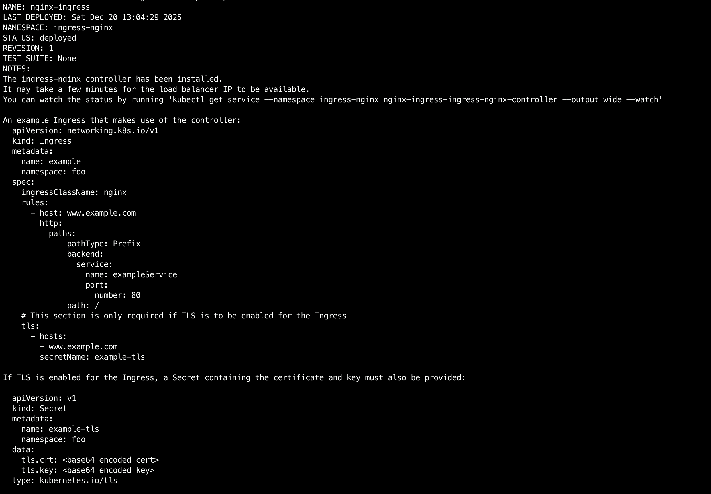
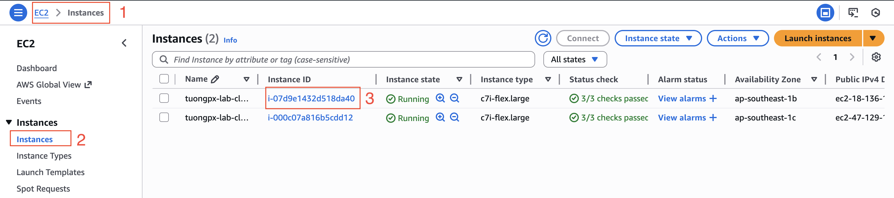
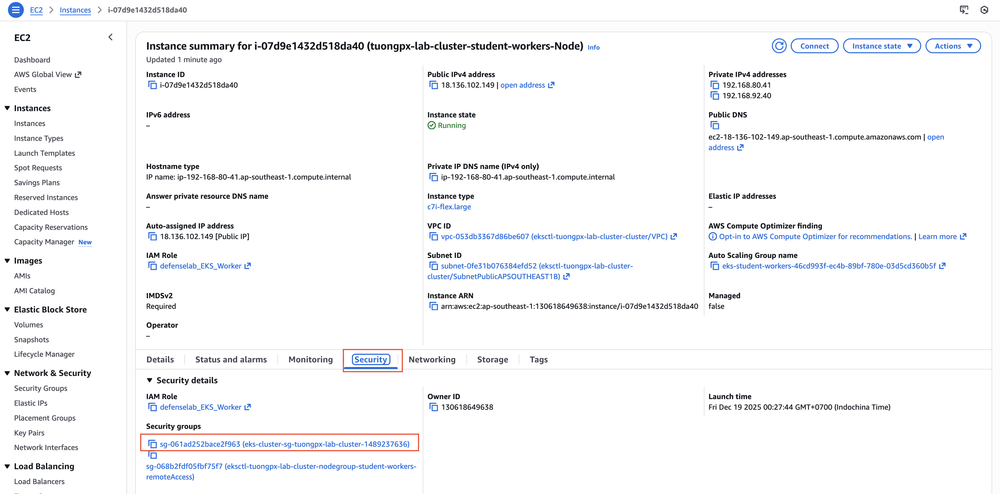
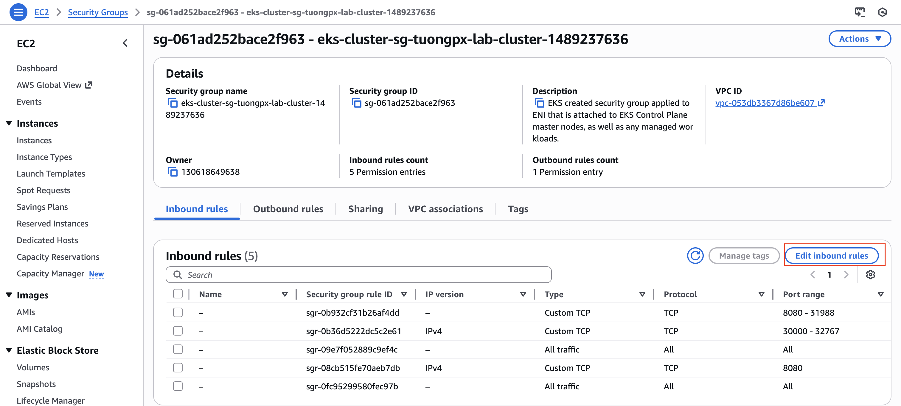
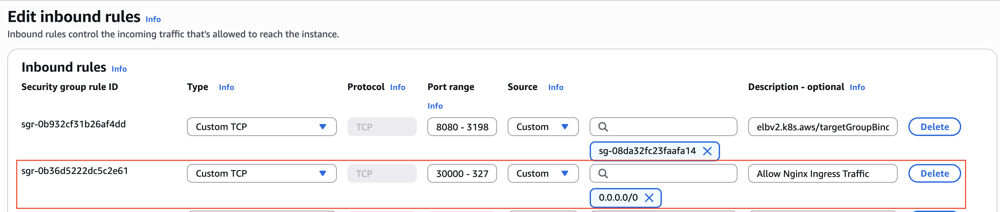

# Triển Khai Helm Chart Thông qua ArgoCD Kết hợp với Nginx Load Balangcer trên EKS

## 🏗️ PHẦN 1: CÀI ĐẶT NGINX VỚI AWS ACM (NLB SSL TERMINATION)
Đây là bước thay đổi quan trọng nhất. Chúng ta sẽ cấu hình để AWS NLB tự động gán chứng chỉ ACM vào cổng 443.

`Chuẩn bị: Copy cái ARN của chứng chỉ ACM *.tonytechlab.com mà bạn đã có.
(Ví dụ: arn:aws:acm:ap-southeast-1:241688915712:certificate/70c58476-9a59-4bdc-b1df-cca71c88963a)`

Lệnh cài đặt (Helm):

Copy nguyên khối lệnh này vào CMD (Nhớ thay dòng ARN bằng của bạn):

```bash
helm repo add ingress-nginx https://kubernetes.github.io/ingress-nginx
helm repo update

helm install nginx-ingress ingress-nginx/ingress-nginx \
  --namespace ingress-nginx \
  --create-namespace \
  --set controller.service.type=LoadBalancer \
  --set controller.service.annotations."service.beta.kubernetes.io/aws-load-balancer-type"="nlb" \
  --set controller.service.annotations."service.beta.kubernetes.io/aws-load-balancer-scheme"="internet-facing" \
  --set controller.service.annotations."service.beta.kubernetes.io/aws-load-balancer-ssl-cert"="arn:aws:acm:ap-southeast-1:130618649638:certificate/c23e55fa-a6b5-4356-909a-30297254c2cb" \
  --set controller.service.annotations."service.beta.kubernetes.io/aws-load-balancer-ssl-ports"="443" \
  --set controller.service.targetPorts.https=http
```


```bash
Giải thích tham số (Tại sao đây là chuẩn AWS?):

    + ...ssl-cert: Gắn chứng chỉ ACM trực tiếp vào NLB.

    + ...ssl-ports: Mở cổng 443 trên NLB.

    + targetPorts.https=http: SSL Offloading. NLB giải mã xong sẽ gửi traffic HTTP (80) vào Nginx. Nginx không cần lo việc giải mã nữa (nhẹ hơn, nhanh hơn).
```

##  PHẦN 2: MỞ CỔNG NODE (BẮT BUỘC)

Khi bạn chạy lệnh tạo Cluster (dù bằng eksctl hay Console), AWS EKS sẽ tự động sinh ra một cái Security Group mặc định cho Cluster đó. Nó dùng để bảo vệ các Node và Control Plane.

Vì dùng NLB, ta vẫn phải mở cổng cho Worker Node (như bài trước đã làm).

### Bước 1: Xác định Security Group của Node

1. Vào AWS EC2 Console -> Menu trái chọn Instances.
2. Tìm và tích chọn máy Worker Node đang chạy (Ví dụ: tony-lab-cluster-student-workers-Node).



3. Ở tab Security (phía dưới), tìm mục Security groups.



4. Bấm vào cái Security Group có tên dài dạng: eks-cluster-sg-tuongpx-lab-cluster-<số_ngẫu_nhiên>.
    - (Đây là SG mặc định được EKS tự động tạo ra khi khởi tạo Cluster).

### Bước 2: Thêm Rule cho phép Traffic từ NLB

1. Trong trang Security Group, chọn tab Inbound rules -> Bấm Edit inbound rules.


2. Kéo xuống dưới cùng, bấm Add rule.

3. Điền thông tin:
    `Type: Custom TCP.

     Port range: 30000-32767 (Đây là dải cổng mà Kubernetes dùng cho NodePort Service).

     Source: 0.0.0.0/0 (Cho phép truy cập từ mọi nơi – Hoặc an toàn hơn là điền dải IP của VPC nếu NLB nằm trong VPC, nhưng với Lab thì để 0.0.0.0/0 cho tiện).

     Description: Allow Nginx Ingress Traffic.
    `


4. Bấm Save rules.
