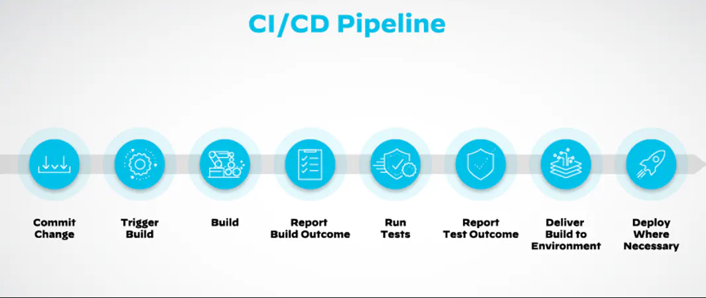

# 🚀 CI/CD & GitOps
- This document explains CI/CD and GitOps in a clear and simple way, suitable for readers who have no prior knowledge of DevOps.
----
## 🧩 1. Why CI/CD Exists — The Problem in Traditional Development
- Before CI/CD, software teams often faced big challenges:

    - Merge conflicts when combining code from different developers

    - Integration failures — code works on one machine but fails when merged

    - Manual build, test, and deployment — slow and error-prone

    - The classic excuse: “It works on my machine!”
- CI/CD was created to solve these problems through automation.
----
## 🎯 2. What is CI/CD?
- CI/CD stands for two main concepts: Continuous Integration and Continuous Delivery/Deployment. This is a method of automating the software development process, helping to get products from programmers to end users faster, safer and more reliably.
- CI/CD includes:

    - CI — Continuous Integration

    - CD — Continuous Delivery / Continuous Deployment
- These practices automate the entire flow from writing code → building → testing → deploying, making development faster, safer, and more reliable.\
- A typical CD pipeline is a sequence of automated “quality gates,” where each gate must be passed before reaching the next one.

----
## 🔧 3. Continuous Integration (CI)
- With CI, developers frequently push their changes to a shared Git repository.
Every push triggers an automated process:

    - Build the application

    - Run unit tests and integration tests

    - Detect errors early
### 🎯 Goal
- CI ensures the codebase is always healthy, reducing big merge problems and making integration smooth.
- Think of it like cleaning a house a little every day instead of waiting for a massive month-end cleanup.
----
## 📦 4. Continuous Delivery (CD)
- Continuous Delivery ensures that every build after CI is ready for production.

- A typical CD pipeline automates:

    - Build

    - Test

    - Deploy to Staging

    - Execute E2E, performance, and security checks

👉 The only manual step left is clicking “Deploy to Production”.
### 🎯 Goal: “Always Ready”

- Reduce deployment risk

- Make releases predictable and repeatable

- Allow business teams to choose the best release timing.
----
## ⚙️ 5. Continuous Deployment (CD)
- Continuous Deployment takes automation one step further:

    - After all automated tests pass

    - Code is auto-deployed to Production

    - No human approval required

### 🎯 Benefits

- Small, frequent, safe releases

- Faster feedback from real users

- Developers focus on coding, not deployment anxiety

### 🧱 Requirements

- Strong automated testing

- Reliable pipelines

- Robust monitoring & alerting
----
## 🛡️ 6. Safe Deployment Strategies
### 🔵 Blue–Green Deployment
- Two identical environments:
    - Blue (current) and Green (new).

    - Deploy to Green → verify → switch traffic to Green.

- Pros: fast rollback, minimal downtime
- Cons: double infrastructure cost

### 🟡 Canary Deployment
- Deploy to a small percentage of users (1–5%) → monitor → gradually increase.

- Pros: limits impact, real-world validation
- Cons: requires advanced monitoring

### 🟣 Feature Flags (Toggles)
- Code is deployed with features disabled.
- Features can be turned on/off at runtime.

- Pros: safe release, instant rollback, A/B testing
- Cons: can create technical debt
----
## 🔄 7. Summary — CI vs Delivery vs Deployment
| Stage                | CI     | Continuous Delivery | Continuous Deployment |
| -------------------- | ------ | ------------------- | --------------------- |
| Build                | ✔ Auto | ✔ Auto              | ✔ Auto                |
| Unit Tests           | ✔ Auto | ✔ Auto              | ✔ Auto                |
| Deploy to Staging    | ✖      | ✔ Auto              | ✔ Auto                |
| Acceptance Tests     | ✖      | ✔ Auto              | ✔ Auto                |
| Deploy to Production | ✖      | ✔ Manual            | ✔ Auto         |
----
## 🔥 8. What is GitOps?
- GitOps is a way of managing infrastructure and applications using Git as the single source of truth.

- Instead of deploying manually or using kubectl, you simply:

    - Update the desired state (YAML) in Git

    - Commit and push

- An agent inside your cluster detects the change and automatically applies it.
----
## 🎣 9. Pull-Based Model — The Heart of GitOps
### 🟥 Push-Based CI/CD (Traditional)

- CI/CD system pushes changes to the cluster

- CI/CD needs production credentials

- Risk of config drift (real system ≠ Git state)
### 🟩 Pull-Based GitOps (Modern)

- An in-cluster agent (Argo CD, Flux) watches Git

- When Git changes → agent pulls and applies changes

- If someone manually modifies the cluster, the agent restores the Git state
### ✨ Key Benefits

- More secure (no CI/CD credentials in production)

- Self-healing (auto-corrects config drift)

- Easy rollback (just revert a Git commit)

- Developer-friendly (just Git commits)

👉 GitOps, with its pull-based philosophy, is a natural evolution of CI/CD. It does not replace CI; instead, it completes and strengthens the CD process. The CI/CD pipeline remains responsible for building, testing, and pushing new images to the image registry. GitOps takes care of everything afterward: automatically detecting new images and deploying them in a safe, secure, and reliable way.