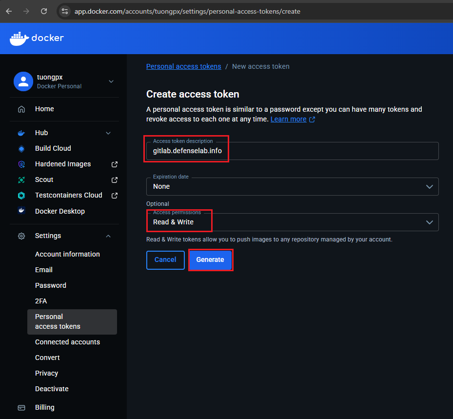

# Hands-on CICD Lab with Gitlab Runner and Docker
📋 Lab Objective: This guide walks you through setting up a complete CI/CD environment using GitLab integrating with Docker to automatically build and deploy applications.
## Step 1: Create Group in Gitlab
In Gitlab, Group is a top-level container used to organize related projects and manage users under a shared namespace.
- Log in to GitLab with Admin privileges.
- Navigate to Admin Area (wrench icon in the top-left corner).
- Select New Group.
- Enter the Group name (e.g., devops).
- After creation, switch to the newly created Group to work within it.

## Step 2: Create Project
Create a new project to hold your source code and CI/CD pipeline configuration.
- Within the created Group, select New Project.

- Select `Create blank project`

- Enter the project information and click `Create project`

- You now have a Git repository ready on GitLab.
- Now we can push code to gitlab project
```bash
cd corejs2
git config --local user.name "Pham Xuan Tuong"
git config --local user.email "tuongpx@defenselab.info"
git remote rename origin old-origin
git remote add origin http://gitlab.defenselab.info/mobile-app/corejs2.git
git push --set-upstream origin --all
git push --set-upstream origin --tags
```
- ASince we registered the GitLab Runner in the previous lab, we don't need to register it again here.
## Step 3: Create Docker hub Personal Access Token
- Navigate to Account Settings → Personal access tokens.

- Click Generate new token.
- Configure the token:
    - Token description: Name it
    - Access permissions: Select Read & Write.
    - Expiration date: Choose an expiration date.
- Click Generate

## Step 4: Create CI/CD Variable
Store Docker Hub credentials as environment variables for use in the pipeline.
- Navigate to your new created Group.
- Go to Settings → CI/CD.
- Expand the Variables section.
- Click Add variable and create the following two variables:
#### Variable 1: DOCKER_USERNAME

- Key: DOCKER_USERNAME
- Value: Your Docker Hub username (e.g., username)
- Type: Variable
- Protected: Optional
- Masked: Optional

#### Variable 2: DOCKER_PASSWORD

- Key: DOCKER_PASSWORD
- Value: The personal access token created from Docker Hub
- Type: Variable
- Protected: Optional
- Masked: Check (to hide the token in logs)


## Step 5: Config Gitlab-runner
- Open Gitlab runner config file
``` bash
sudo vim /etc/gitlab-runner/config.toml
```
```bash
concurrent = 1
check_interval = 0
connection_max_age = "15m0s"
shutdown_timeout = 0

[session_server]
  session_timeout = 1800

[[runners]]
  name = "docker-runner"
  url = "http://gitlab.defenselab.info"
  id = 5
  token = "glrt-xqnUp1RY8RDr57G2BTcDkG86MQp0OjEKdToxCw.01.120dgmsun"
  token_obtained_at = 2025-12-10T09:56:40Z
  token_expires_at = 0001-01-01T00:00:00Z
  executor = "docker"
  [runners.cache]
    MaxUploadedArchiveSize = 0
    [runners.cache.s3]
    [runners.cache.gcs]
    [runners.cache.azure]
  [runners.docker]
    tls_verify = false
    image = "docker:latest"
    privileged = true
    disable_entrypoint_overwrite = false
    oom_kill_disable = false
    disable_cache = false
    volumes = ["/cache"]
    shm_size = 0
    network_mtu = 0
    volumes = ["/var/run/docker.sock:/var/run/docker.sock", "/cache"]
```
- After pushing code with a .gitlab-ci.yml file to the repository, the pipeline will run automatically
```bash
stages:
  - build
  - deploy

variables:
  # Disable Docker TLS for dind
  DOCKER_TLS_CERTDIR: ""
#  DOCKER_HOST: "tcp://docker:2375"    # <- ensure docker client talks to dind service
  DOCKER_BUILDKIT: "1"                # <- use BuildKit for buildx pushes

# Build CoreAPI image using buildx and push to Docker Hub (registry cache enabled)
build_coreapi:
  stage: build
  image: docker:latest
  services:
    - name: docker:latest
      alias: docker
  variables:
    DOCKER_DRIVER: overlay2
  before_script:
    - echo "$DOCKER_PASSWORD" | docker login -u "$DOCKER_USERNAME" --password-stdin
    - docker buildx create --use || true
    - docker info | sed -n '1,5p'   # quick sanity check (no secrets printed)
  script:
    - |
      DATE=$(date +%Y%m%d)
      SHA=${CI_COMMIT_SHORT_SHA}
      IMAGE_TAG="$DATE-$SHA"
      REPO="$DOCKER_USERNAME/corejs-coreapi"
      docker buildx build --progress=plain --platform linux/amd64 --push \
        --tag "$REPO:latest" --tag "$REPO:$IMAGE_TAG" \
        --cache-from=type=registry,ref="$REPO:buildcache" \
        --cache-to=type=registry,ref="$REPO:buildcache",mode=max \
        -f CoreAPI/Dockerfile CoreAPI
  rules:
    - if: '$CI_COMMIT_BRANCH == "nodejs"'

# Build Frontend image using buildx and push to Docker Hub (registry cache enabled)
build_frontend:
  stage: build
  image: docker:latest
  services:
    - name: docker:latest
      alias: docker
  variables:
    DOCKER_DRIVER: overlay2
  before_script:
    - echo "$DOCKER_PASSWORD" | docker login -u "$DOCKER_USERNAME" --password-stdin
    - docker buildx create --use || true
    - docker info | sed -n '1,5p'
  script:
    - |
      DATE=$(date +%Y%m%d)
      SHA=${CI_COMMIT_SHORT_SHA}
      IMAGE_TAG="$DATE-$SHA"
      REPO="$DOCKER_USERNAME/corejs-frontend"
      docker buildx build --progress=plain --platform linux/amd64 --push \
        --tag "$REPO:latest" --tag "$REPO:$IMAGE_TAG" \
        --cache-from=type=registry,ref="$REPO:buildcache" \
        --cache-to=type=registry,ref="$REPO:buildcache",mode=max \
        --build-arg NODE_ENV=production \
        -f frontend/Dockerfile frontend
  rules:
    - if: '$CI_COMMIT_BRANCH == "nodejs"'

# Deploy to remote server by SSH (uses SSH_PRIVATE_KEY variable)
deploy:
  stage: deploy
  tags:
    - local-shell
  before_script:
    - apk add --no-cache openssh-client bash || true
    - mkdir -p ~/.ssh
    - echo "$SSH_PRIVATE_KEY" > ~/.ssh/id_rsa || true
    - chmod 600 ~/.ssh/id_rsa || true
    - |
      if [ -n "$SERVER" ] && [ "$SERVER" != "localhost" ] && [ "$SERVER" != "127.0.0.1" ]; then
        if [ -n "$PORT" ]; then
          ssh-keyscan -p $PORT $SERVER >> ~/.ssh/known_hosts
        else
          ssh-keyscan $SERVER >> ~/.ssh/known_hosts
        fi
      fi
  script:
    - DESTINATION_PATH="/home/$USERNAME/deployments/corejs"
    - DATE=$(date +%Y%m%d)
    - SHA=${CI_COMMIT_SHORT_SHA}
    - IMAGE_TAG="$DATE-$SHA"
    - |
      echo "Running remote deploy via SSH..."
      ssh ${USERNAME}@${SERVER} "mkdir -p $DESTINATION_PATH"
      scp scripts/deploy.sh ${USERNAME}@${SERVER}:$DESTINATION_PATH/
      ssh ${USERNAME}@${SERVER} "cd $DESTINATION_PATH && \
        DOCKER_USERNAME='${DOCKER_USERNAME}' DOCKER_PASSWORD='${DOCKER_PASSWORD}' IMAGE_TAG='${IMAGE_TAG}' ALLOWED_HOSTS='${ALLOWED_HOSTS}' bash ./deploy.sh"
  dependencies:
    - build_coreapi
    - build_frontend
  rules:
    - if: '$CI_COMMIT_BRANCH == "nodejs"'
```
- Navigate to the project on GitLab.
- Go to CI/CD → Pipelines.
- View the details of the running pipeline.
- Check each job: build-coreapi, build-frontend.

- 🎉 Success! If all jobs pass (displayed in green), you have successfully set up the CI/CD pipeline. The Docker images have been built and pushed to Docker Hub.