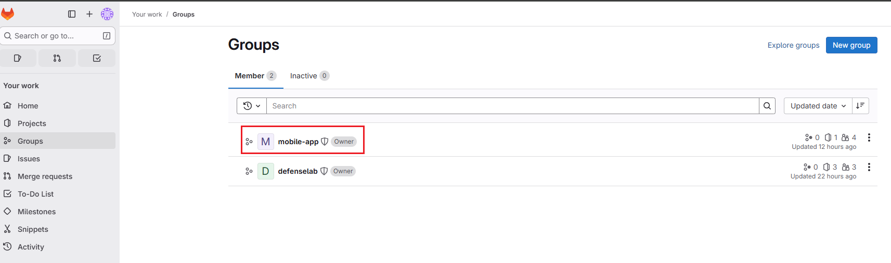
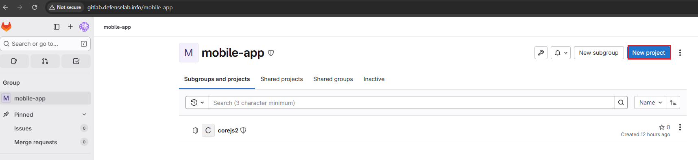

# Hands-on CICD Lab with Gitlab Runner and Docker
📋 Lab Objective: This guide walks you through setting up a complete CI/CD environment using GitLab integrating with Docker to automatically build and deploy applications.
## Step 1: Create Group in Gitlab
In Gitlab, Group is a top-level container used to organize related projects and manage users under a shared namespace.
- Log in to GitLab with Admin privileges.
- Navigate to Admin Area (wrench icon in the top-left corner).
- Select New Group.
- Enter the Group name (e.g., devops).
- After creation, switch to the newly created Group to work within it.

## Step 2: Create Project
Create a new project to hold your source code and CI/CD pipeline configuration.
- Within the created Group, select New Project.

- Select `Create blank project`

- Enter the project information and click `Create project`

