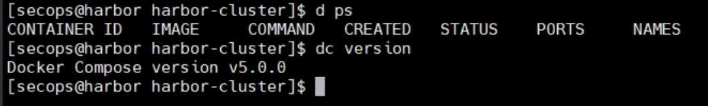
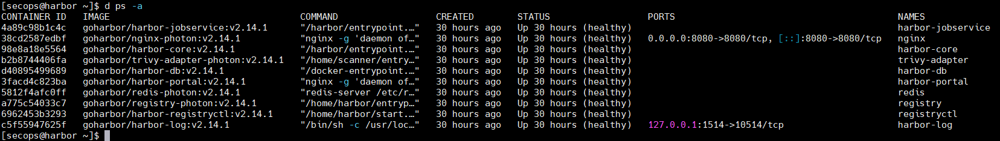

# Cài đặt Docker Chuẩn Production (Production Grade)

⚠️ Nguyên tắc cốt lõi cho Production:
- Cài từ Official Repo của Docker (tránh gói docker.io cũ của Ubuntu).
- Tuyệt đối không thêm user vào group docker (Rủi ro bảo mật root).
- Cấu hình Log Rotation để tránh tràn ổ cứng server.

## Phần 1: Chuẩn bị hệ thống
Trước tiên, cần xóa sạch các phiên bản cũ (nếu có) để tránh xung đột dependencies.

```bash
# 1. Gỡ bỏ các phiên bản cũ 

```bash
sudo dnf remove -y docker \
  docker-client \
  docker-client-latest \
  docker-common \
  docker-latest \
  docker-latest-logrotate \
  docker-logrotate \
  docker-engine
```

# 2. Cài đặt dependency cần thiết

```bash
sudo dnf install -y dnf-plugins-core ca-certificates curl gnupg
```
## Phần 2: Thiết lập Official Repository

Chúng ta sẽ cấu hình để tải Docker trực tiếp từ nguồn chính chủ.

```bash
sudo dnf config-manager \
  --add-repo \
  https://download.docker.com/linux/rhel/docker-ce.repo
```

Update lại hệ thống

```bash
sudo yum update
```
## Phần 3: Cài đặt Docker Engine

```bash
sudo dnf install -y docker-ce docker-ce-cli containerd.io docker-buildx-plugin docker-compose-plugin
```
## Phần 4: Cấu hình Production (Quan trọng)

### 4.1. Cấu hình Log Rotation (Chống tràn ổ cứng)

Mặc định Docker không giới hạn dung lượng log container. Ta cần sửa file `daemon.json`:

```bash
# 1. Mở file cấu hình
sudo vimvim /etc/docker/daemon.json

# 2. Paste nội dung sau vào:
{
  "log-driver": "json-file",
  "log-opts": {
    "max-size": "100m",
    "max-file": "3"
  },
  "storage-driver": "overlay2",
  "exec-opts": ["native.cgroupdriver=systemd"],
  "live-restore": true
}
```
### 4.2. Khởi động Service

```bash
sudo systemctl daemon-reload
sudo systemctl start docker
sudo systemctl enable docker
```
# Phần 5: Bảo mật & Alias Tiện ích

⛔ SECURITY WARNING:
Không chạy lệnh sudo usermod -aG docker $USER trên server Production. Điều này tương đương với việc trao quyền Root không cần mật khẩu cho user đó.

Thay vì add user vào group, ta tạo lệnh tắt (alias) để tự động thêm sudo khi gõ lệnh. An toàn và tiện lợi.
```bash
# Chạy lệnh này để ghi alias vào cuối file .bashrc
echo "alias d='sudo docker'" >> ~/.bashrc
echo "alias dc='sudo docker compose'" >> ~/.bashrc

# Kích hoạt ngay lập tức
source ~/.bashrc
```

💡 Tip Troubleshooting:
Nếu gặp lỗi “Command not found” sau khi tạo alias, hãy kiểm tra file ~/.bashrc xem có bị lỗi dấu nháy (quote) do copy paste không. Hãy dùng lệnh nano ~/.bashrc để sửa lại.

# Phần 6: Kiểm tra kết quả

Sử dụng alias d và dc vừa tạo để kiểm tra phiên bản:

```bash
# Kiểm tra docker
d ps

# Kiểm tra compose
dc version
```


# Phần 7: Lab cài đặt Harbor Registry

## Bước 1: Tải bộ cài 

```bash
wget https://github.com/goharbor/harbor/releases/download/v2.14.1/harbor-offline-installer-v2.14.1.tgz
tar -xvf harbor-offline-installer-v2.14.1.tgz
mv harbor /opt/harbor-cluster
```
## Bước 2: Tinh chỉnh cấu hình

```bash
cd harbor-cluster/
cp harbor.yml.tmpl harbor.yml
```
Những dòng cần sửa (Quan trọng):
- hostname: Đổi thành domain của anh em (VD: harbor.tonytechlab.com).
- http port: Đổi thành 8088 (Tránh port 80 để không đánh nhau với Nginx Proxy Manager).
- https: Tìm và thêm dấu # để comment (tắt) toàn bộ phần này. Chúng ta sẽ xử lý SSL ở tầng Proxy cho nhàn đầu.
- harbor_admin_password: Đổi mật khẩu admin mặc định (đừng để 123456 nhé).

## Bước 3: Triển khai (Deploy)
Sau khi cấu hình xong xuôi, anh em chạy script cài đặt. Nhớ thêm 2 options bên dưới để Harbor cài thêm module quản lý Helm Chart và module quét bảo mật Trivy.

```bash
./install.sh --with-chartmuseum --with-trivy
```
✅ Kết quả: Khi màn hình hiện thông báo thành công, anh em dùng lệnh docker-compose ps sẽ thấy một loạt service trạng thái Up. Vậy là xong phần core!

