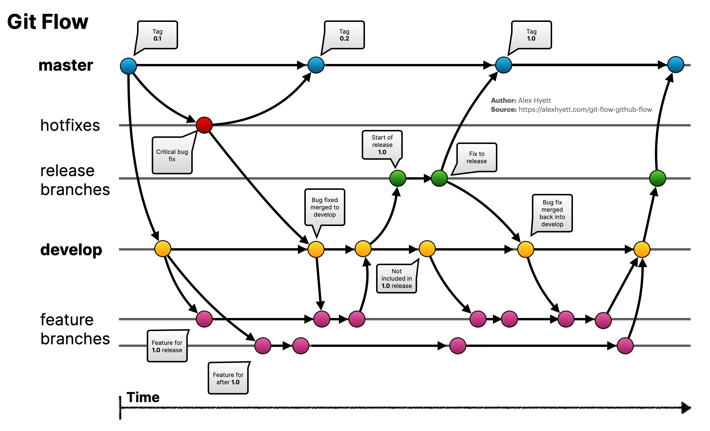

# 🔐 A Quick Git Guide
Git is one of the essential tools in any DevSecOps workflow. Whether you’re building CI/CD pipelines, managing infrastructure as code (IaC), or reviewing secure changes, Git ensures that every line of code is tracked, auditable, and versioned properly. This quick guide will guide you through Git basics with a DevSecOps perspective—so you can work securely, efficiently, and collaboratively.

----
## 🧩 1. What is Git?
Git is a distributed version control system (DVCS) that tracks changes in your code and allows teams to collaborate without risking data loss or overwriting work.
In DevSecOps, Git is the foundation for:
- Secure code review
- Pipeline automation
- Policy-as-Code
- Infrastructure-as-Code
- Auditable changes (compliance)
- Rollback and disaster recovery

----
## 🏗️ 2. Setting Up Git
### Install Git
#### Linux
```bash
sudo apt install git     # Ubuntu/Debian
sudo yum install git     # RHEL/CentOS/Rocky
```
#### Mac
```bash
brew install git
```
#### Windows

#### Check version
```bash
git --version
```
#### Configure user identity
```bash
git config --global user.name "Your Name" 
git config --global user.email "you@example.com"
```
----
## 📦 3. Creating or Cloning a Repository
### Initialize a Git Repository
Create a new repository for your project:
```bash
mkdir your_git_project 
cd your_git_project 
git init
```
### Clone an existing repository
```bash
git clone https://github.com/username/project.git
```
### Create and Commit Your First File
Creat a simple file:
```bash
echo "# Here is the first file" > "File_name"
```

Check the status of your repository.
```bash
git status
```
This will show your file as untracked. Stage the file for commit
```bash
git add .
```
Commit the stage file with comment
```bash
git commit -m "Your comment here"
```
Uploads your local commits to the remote repository.
```bash
git push
```
### View Commit History
Check the commit history
```bash
git log
```
----
### ✍️ 4. The Git Workflow


#### **Branches:**
    - `master` → Production-ready code. Each commit here represents a released version (tagged).
    - `develop` → Integration branch containing code for the next release.
    - `Feature branches` (feature/*) → Used to develop new features. Created from develop and merged back into develop.
    - `Release branches` (release/*) → Created from develop to prepare a new version (testing, polishing). Merged into both master and develop.
    - `Hotfix branches` (hotfix/*) → For urgent production fixes. Created from master, then merged back into both master and develop.

#### Create and Switch Branches
Create a new branch named feature-a:
```bash
git branch feature-a
```
Switch to the feature-a branch.
```bash
git checkout feature-a
```
Use combine command to create and switch to the new branch
```bash
git checkout -b feature-a
```
Create a new file in feature-a
```bash
echo "Here is new file in feature-a" > new_file_FA.txt
git add new_file_FA.txt
git commit -m "Added new file"
```

----
### 📤 5. Pushing and Pulling Code
Push your changes to remote:
```bash
git push origin feature/add-logging
```
Pull updates from remote:
```bash
git pull
```
⚠️ Always pull before starting work to reduce merge conflicts.

----
### 🔀 7. Merge, Pull Requests & Secure Code Reviews
In DevSecOps, merging is not just about combining code—it’s about ensuring security, quality, and compliance.\
A secure Git process usually includes:
```bash
Working Directory → Staging Area → Commit → Push → PR/MR → Review → Merge → Pipeline
```
    - Push your branch
    - Create Pull Request (PR) or Merge Request (MR)
    - Request reviewers
    - Run automated security checks (SAST, SCA, IaC scanning)
    - Merge into main

----
### ⚠️ 8. Handling Merge Conflicts
Conflicts happen when two people change the same code.\
Git will mark conflict sections like this:
```bash
<<<<<<< HEAD
current code
=======
incoming code
>>>>>>> feature/add-logging`
```