----
# 🔐 A Quick Git Guide
Git is one of the essential tools in any DevSecOps workflow. Whether you’re building CI/CD pipelines, managing infrastructure as code (IaC), or reviewing secure changes, Git ensures that every line of code is tracked, auditable, and versioned properly. This quick guide will guide you through Git basics with a DevSecOps perspective—so you can work securely, efficiently, and collaboratively.

----
## 🧩 1. What is Git?
Git is a distributed version control system (DVCS) that tracks changes in your code and allows teams to collaborate without risking data loss or overwriting work.
In DevSecOps, Git is the foundation for:
- Secure code review
- Pipeline automation
- Policy-as-Code
- Infrastructure-as-Code
- Auditable changes (compliance)
- Rollback and disaster recovery

----
## 🏗️ 2. Setting Up Git
### Install Git
#### Linux
```bash
sudo apt install git     # Ubuntu/Debian
sudo yum install git     # RHEL/CentOS/Rocky
```
#### Mac
```bash
brew install git
```
#### Windows

#### Check version
```bash
git --version
```
#### Configure user identity
```bash
git config --global user.name "Your Name" 
git config --global user.email "you@example.com"
```
----
## 📦 3. Creating or Cloning a Repository
### Initialize a Git Repository
Create a new repository for your project.
```bash
mkdir your_git_project 
cd your_git_project 
git init
```
### Clone an existing repository
```bash
git clone https://github.com/username/project.git
```
### Create and Commit Your First File


----
Creat a simple file.
```bash
echo "# Here is the first file" > "File_name"
```

Check the status of your repository.
```bash
git status
```
This will show your file as untracked. Stage the file for commit.
```bash
git add .
```
Commit the stage file with comment.
```bash
git commit -m "Your comment here"
```
Uploads your local commits to the remote repository.
```bash
git push
```
### View Commit History
Check the commit history.
```bash
git log
```
----
### ✍️ 4. The Git Workflow


#### **Branches:**
    - `master` → Production-ready code. Each commit here represents a released version (tagged).
    - `develop` → Integration branch containing code for the next release.
    - `Feature branches` (feature/*) → Used to develop new features. Created from develop and merged back into develop.
    - `Release branches` (release/*) → Created from develop to prepare a new version (testing, polishing). Merged into both master and develop.
    - `Hotfix branches` (hotfix/*) → For urgent production fixes. Created from master, then merged back into both master and develop.

#### Create and Switch Branches
Create a new branch named feature-a.
```bash
git branch feature-a
```
Switch to the feature-a branch.
```bash
git checkout feature-a
```
Use combine command to create and switch to the new branch.
```bash
git checkout -b feature-a
```
Create a new file in feature-a.
```bash
echo "Here is new file in feature-a" > new_file_FA.txt
git add new_file_FA.txt
git commit -m "Added new file"
```
#### Merge Branches
Switch back to the master branch.
```bash
git checkout master
```
Merge feature-a to master.
```bash
git merge feature-a
```
Verify the merge by checking the content new_file_FA.txt in the master branch.
----
### 📤 5. Pushing and Pulling Code
Push your changes to remote.
```bash
git push origin feature/add-logging
```
Pull updates from remote.
```bash
git pull
```
⚠️ Always pull before starting work to reduce merge conflicts.

----
### 🔀 7. Merge, Pull Requests & Secure Code Reviews
In DevSecOps, merging is not just about combining code—it’s about ensuring security, quality, and compliance.\
A secure Git process usually includes:
```bash
Working Directory → Staging Area → Commit → Push → PR/MR → Review → Merge → Pipeline
```
    - Push your branch
    - Create Pull Request (PR) or Merge Request (MR)
    - Request reviewers
    - Run automated security checks (SAST, SCA, IaC scanning)
    - Merge into main

----
### ⚠️ 8. Handling Merge Conflicts
Conflicts happen when two people change the same code.\
Git will mark conflict sections like this:
```bash
<<<<<<< HEAD
current code
=======
incoming code
>>>>>>> feature/add-logging`
```
#### How to Resolve a Merge Conflict
##### Open the file with conflicts
Git marks all files that require attention when run bellow command:
```bash
git status
```
##### Manually fix the conflict
Choose one of these:
    - Keep your version
    - Keep their version
    - Merge both manually
    - Rewrite the block entirely
Remove Git's conflict markers (<<<<<<<, =======, >>>>>>>).
##### Stage the resolved files
```bash
git add <file>
```
#### Commit the resolution
```bash
git commit
```
----
### 🧪 9. Hands-on Lab: Create and Resolve a Git Conflict
Follow this lab to practice generating and fixing merge conflicts.
#### 🔹 1. Initialize a test repository
```bash
mkdir git-conflict-lab
cd git-conflict-lab
git init
```
#### 🔹 2. Create a file and make your first commit
```bash
echo "Line 1: Hello Git" > demo.txt
echo "Line 2: Original Content" >> demo.txt
git add demo.txt
git commit -m "Initial commit with demo.txt"
```
File content now:
```bash
Line 1: Hello Git
Line 2: Original Content
```
#### 🔹 3. Create Branch A and modify the file
```bash
git checkout -b branch-A
echo "Line 2: Change from Branch A" > demo.txt
git add demo.txt
git commit -m "Branch A modifies line 2"
```
#### 🔹 4. Create Branch B and modify the same line differently
```bash
git checkout master
git checkout -b branch-B
echo "Line 2: Change from Branch B" > demo.txt
git add demo.txt
git commit -m "Branch B modifies line 2"
```
#### 🔹 5. Merge Branch B into Branch A to create a conflict
```bash
git checkout branch-A
git merge branch-B
```
Expected output:
```bash
CONFLICT (content): Merge conflict in demo.txt
```
The file now looks like:
```bash
Line 1: Hello Git
<<<<<<< HEAD
Line 2: Change from Branch A
=======
Line 2: Change from Branch B
>>>>>>> branch-B
```
🎉 You just created a Git conflict!

#### 🔹 6. Resolve the conflict
Edit demo.txt to the final version you want. For example:
```bash
Line 1: Hello Git
Line 2: Final Merged Version
```
Then:
```bash
git add demo.txt
git commit -m "Resolve conflict between Branch A and Branch B"
```
Conflict resolved!

----
## 🛠️ 10.Hands-on lab: Installing GitLab CE and Gitlab Runner.
This guide explains how to install GitLab CE and GitLab Runner on a single Rocky Linux 9 server.
It is optimized for a LAB environment with the following specs:
    - 4 vCPU
    - 4GB RAi
    - 30GB storage
### 🎯 Lab Objectives
By completing this lab, you will be able to:

    - Understand the roles of GitLab and GitLab Runner in a modern DevOps workflow.
    - Install GitLab Community Edition (CE) on a local or lab server.
    - Configure and register GitLab Runner to execute CI/CD pipelines.

This lab provides foundational hands-on experience with source code management and CI/CD automation.
### 📌 Why This Lab Uses GitLab CE + GitLab Runner on One Server
In production environments, GitLab and GitLab Runner are typically installed on separate servers or Kubernetes nodes. However, for learning and testing, running both on a single small machine allows you to:

    - Practice GitLab administration
    - Learn Git workflow and repository management
    - Build and test CI/CD pipelines
    - Understand how GitLab Runner executes jobs

This lab is designed specifically for small environments and limited hardware.
#### 🧩 1. Update the System
```bash
sudo dnf update -y
sudo dnf install -y curl policycoreutils openssh-server
sudo systemctl enable sshd --now
```
#### 🧩 3. Add GitLab CE Repository
```bash
curl https://packages.gitlab.com/install/repositories/gitlab/gitlab-ce/script.rpm.sh | sudo bash
```
#### 🧩 4. Install GitLab CE
Replace the URL below with your lab hostname or IP. In this lab, I use domain ` defenselab.info` as lab environment domain.
```bash
sudo EXTERNAL_URL="http://gitlab.defenselab.info" dnf install -y gitlab-ce
```
#### 🧩 5. Open Required Ports
```bash
sudo firewall-cmd --permanent --add-service=http
sudo firewall-cmd --permanent --add-service=https
sudo firewall-cmd --reload
```
#### 🧩 6. Access GitLab Web Interface
Visit:
```bash
http://gitlab.defenselab.info
```
Retrieve the initial password:
```bash
sudo cat /etc/gitlab/initial_root_password
```
🎉 And now, see our result.


When logging into GitLab for the first time, the system will prompt you to set a new password for the default administrator account (root).\
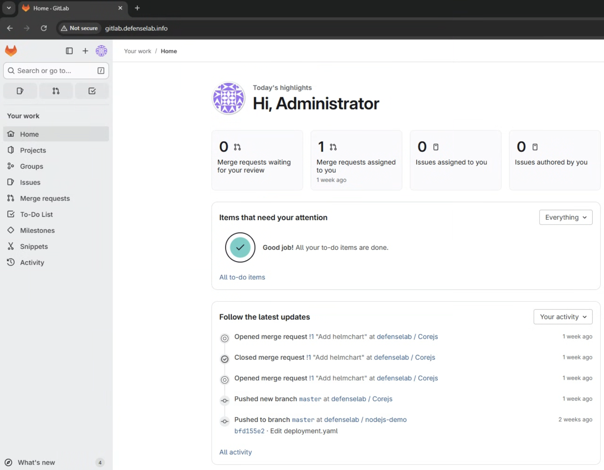
After updating the password, you can access the Admin Area to manage gitlab.


##### 6.1. Manage User
###### Step 1 — Create a new user
In the left sidebar, navigate to:
`Admin Area → Overview → Users`
Click `New User`.
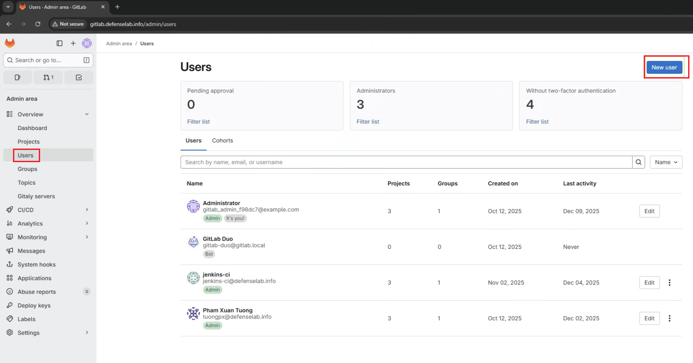
Fill in:
        ```bash
        Name
        Username
        Email
        Password
        ```
Click Create user.
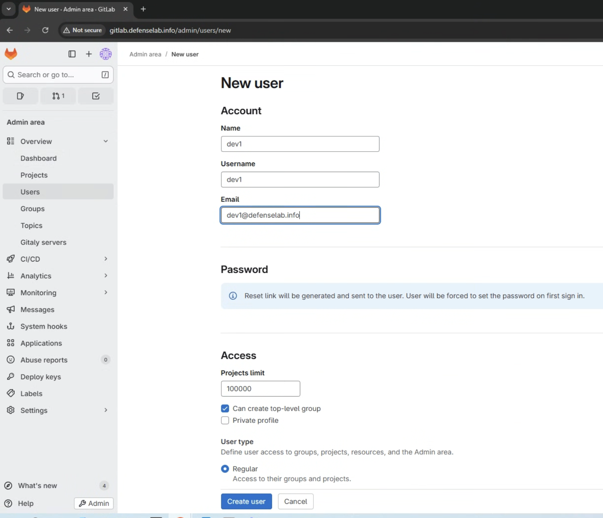
Gitlab server will sent an email to change password for first time login.\
###### Step 2 — Adjust user permissions
Adjust user permissions:
        ```bash
        Regular
        Administrator
        ```
##### 6.2. Manage Group
Groups help organize projects and manage permissions for multiple users—especially useful in DevOps teams.
###### Step1 - Navigate to Groups
    - Open the GitLab menu.
    - Select Groups.
    - Click New Group.
    - Enter:
        Group name
        Group URL
        Visibility level (Private / Internal / Public)
Then click `Create Group`.
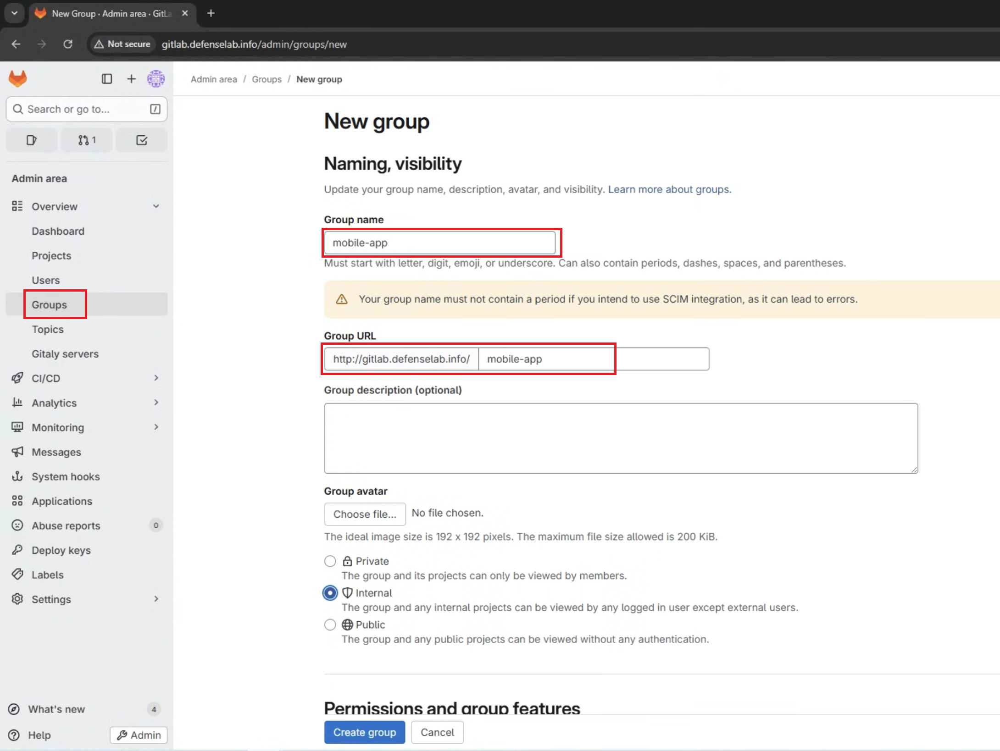

###### Step 2 — Add members to the group
Inside the group:

    - Go to Group → Manage → Members → Invite members

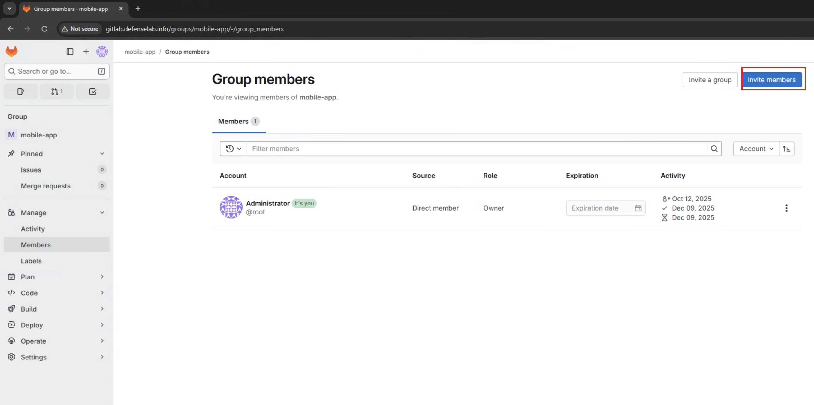

    - Search for the user you created earlier

    - Assign a role:

        - Guest

        - Reporter

        - Developer

        - Maintainer

        - Owner

Click Invite

##### 6.3. Creating a Project in GitLab
A project is where you store your source code, CI/CD pipelines, and repository settings.
###### Step 1 — Create a project inside the group
Navigate to the group you created:
    - Click New Project

    - Select:

        - Create blank project

        - or Import from GitHub/GitLab

        - or Use a template
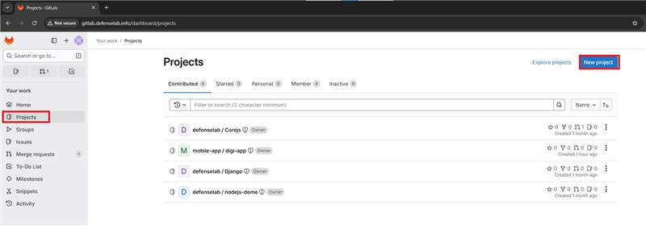
###### Step 2 — Fill project details
Enter:
    - Project name

    - Project description

    - Visibility (Private/Internal/Public)

    - Initialize repository with README (recommended)

Then click Create Project.
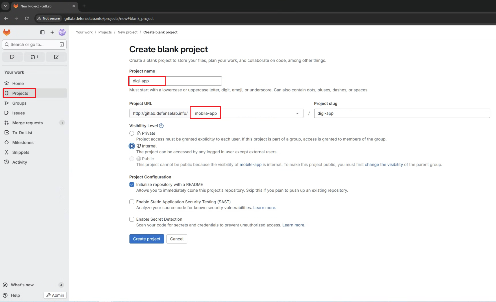
###### Step 3 — Push code into the new project
GitLab will display instructions like:
```bash
git remote add origin http://gitlab.defenselab.info/mobile-app/digi-app.git
git add .
git commit -m "Initial commit"
git push -u origin main
```


#### 🚀 7. Install GitLab Runner
Add the repository:
```bash
curl -L https://packages.gitlab.com/install/repositories/runner/gitlab-runner/script.rpm.sh | sudo bash
```
Install Runner:
```bash
sudo dnf install -y gitlab-runner
```
Start Runner:
```bash
sudo systemctl enable --now gitlab-runner
```
Register GitLab Runner
In GitLab UI:
```bash
Admin → CI/CD → Runners → New Runner
```
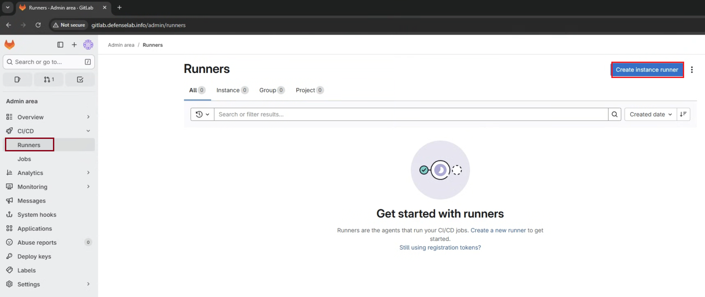
Then click `Create instance runner`

In register tab, enter the information for runner:
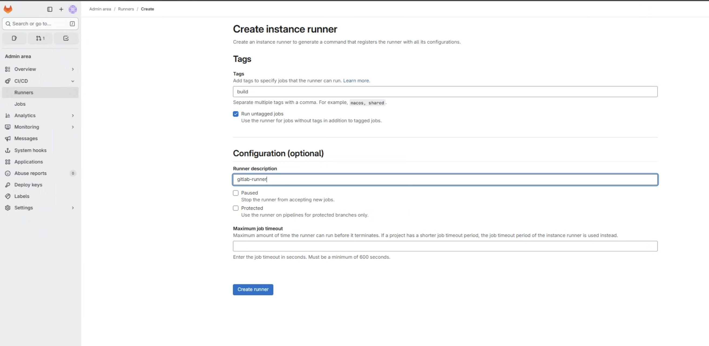
Then click `Create runner`

To register runner, select `Operation System` → Copy `runner authentication token` → Paste to Gitlab server
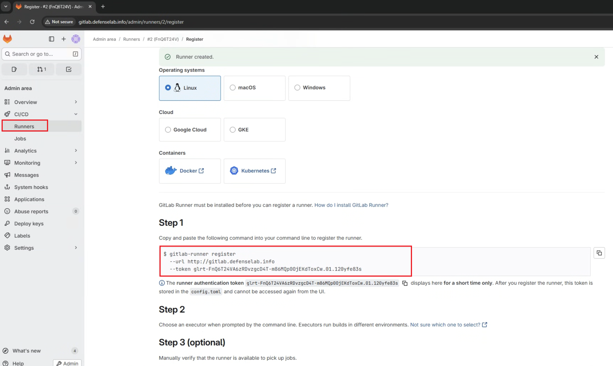

Verify runner:
```bash
gitlab-runner run
```
Testing CI/CD pipeline

Create `.gitlab-ci.yml` :

```bash
stages:
  - build
job_build:
  stage: build
  script:
    - echo "Hello, this is a CI/CD job!"
    - echo "The job is running on a GitLab Runner."
```
Commit & push → The pipeline should run on your local runner.
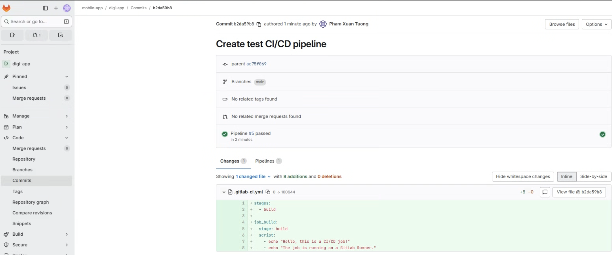

#### 🗂️ 8. Useful Commands (GitLab CE + Runner)

| Component | Command                                | Description           |
| --------- | -------------------------------------- | --------------------- |
| GitLab    | `sudo gitlab-ctl status`               | Check GitLab services |
| GitLab    | `sudo gitlab-ctl restart`              | Restart GitLab        |
| GitLab    | `sudo gitlab-ctl tail`                 | Live logs             |
| Runner    | `sudo systemctl restart gitlab-runner` | Restart Runner        |
| Runner    | `gitlab-runner verify`                 | Verify connection     |
