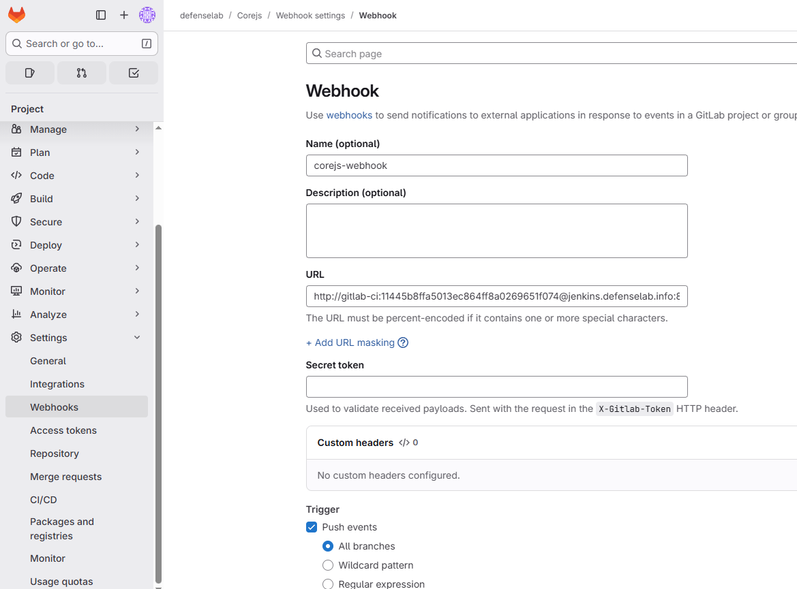
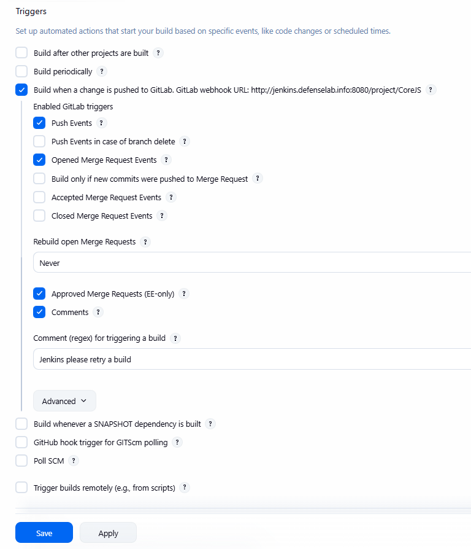
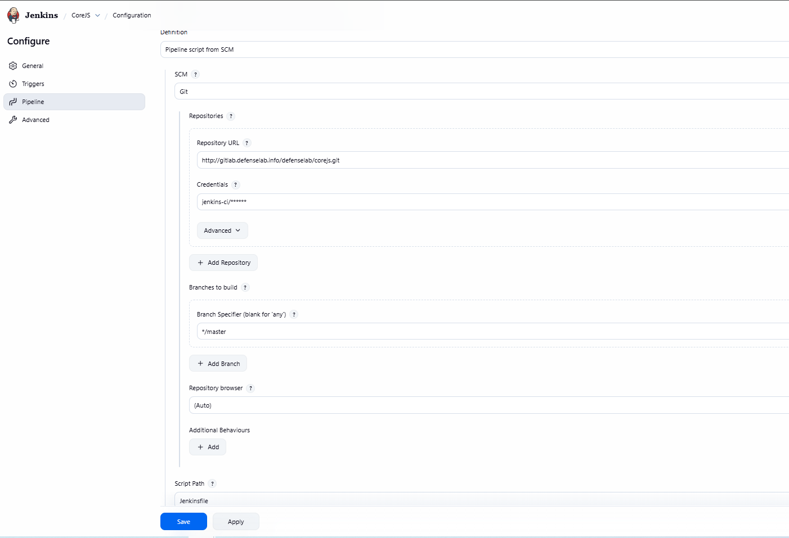

# 🛠️ CI/CD Lab – All-in-One Deployment (Frontend + Backend → Kubernetes)

## 🧱 Lab Components
### Core Infrastructure
| Server Name             | IP Address    | Role                          | Description 
--------------------------------------------------------------------------------------------------------------------------------------------------------------------------------
| dns.defenselab.info     | 192.168.80.16 | DNS Server (Technitium)       | Provides internal DNS resolution for all services, including GitLab, Jenkins, Harbor, and Kubernetes nodes.

| jenkins.defenselab.info | 192.168.80.17 | CI/CD Orchestrator            | Jenkins Controller used to build Docker images and deploy applications to Kubernetes clusters.

| gitlab.defenselab.info  | 192.168.80.18 | Git Repository Manager        | Hosts source code, GitLab Runners (optional), Webhooks for Jenkins, and CI variables.

| harbor.defenselab.info  | 192.168.80.21 | Container Registry            | Private OCI-compliant registry for storing Docker images pushed by Jenkins.

| k8s-lb01.defenselab.info| 192.168.80.22 | Load Balancer / Reverse Proxy | Fronts Kubernetes API or apps, or provides ingress for GitLab, Jenkins, and Harbor if needed.

### Kubernetes Cluster Nodes
| Node     | IP Address    | Role                     | Description                                                       
| -------- | --------------| ------------------------ | ----------------------------------------------------------------- 
| master01 | 192.168.80.10 | Kubernetes Control Plane | Manages API server, scheduler, controller manager, cluster state. 
| worker01 | 192.168.80.30 | Kubernetes Worker Node   | Runs Production workloads (Pods/Deployments).                     
| worker02 | 192.168.80.31 | Kubernetes Worker Node   | Runs Production workloads (Pods/Deployments). 

### DNS Record
| DNS Record                 | Points To     | Purpose                                             |
| -------------------------- | ------------- | --------------------------------------------------- |
| gitlab.defenselab.info     | 192.168.80.18 | GitLab web interface                                |
| registry.defenselab.info   | 192.168.80.21 | Harbor Registry endpoint                            |
| jenkins.defenselab.info    | 192.168.80.17 | Jenkins CI/CD                                       |
| harbor.defenselab.info     | 192.168.80.21 | Harbor Portal                                       |
| haproxy.defenselab.info    | 192.168.80.22 | Load balancer entrypoint                            |
| ssh.gitlab.defenselab.info | 192.168.80.18 | Git over SSH                                        |

### Summary Diagram
+------------------------+       +------------------------+
|   Developer (Git Push) | --->  |  GitLab (192.168.80.18)| 
+------------------------+       +------------------------+
                                        |
                                        v
                          Webhook triggers Jenkins
                                        |
                                        v
+------------------------+       +------------------------+
| Jenkins (192.168.80.17)| ---> | Harbor (192.168.80.21) |
+------------------------+       +------------------------+
                                        |
                          Manual Approval (CTO Approval)
                                        |
                                        v
                                Pull images into K8s
                                        |
                                        v
      +-----------------------------------------------------------+
      |               Kubernetes Cluster (defenselab)             |
      |                                                           |
      |   Master: 192.168.80.10                                    |
      |   Workers: 192.168.80.30 / 192.168.80.31                   |
      |                                                           |
      +-----------------------------------------------------------+

External access handled via HAProxy (192.168.80.22)

### Gitlab
Access to Gitlab and clone project `Corejs`
```bash
git clone http://gitlab.defenselab.info/defenselab/corejs.git
```
- I will use Helm to deploy the application to the Kubernetes cluster.
The Helm chart directory structure will be organized as follows:
```bash
helmchart/
└── corejs
    ├── Chart.yaml
    ├── templates
    │   ├── backend-deployment.yaml
    │   ├── backend-service.yaml
    │   ├── frontend-deployment.yaml
    │   ├── frontend-service.yaml
    │   └── ingress.yaml
    └── values.yaml
```

- Jenkinsfile as follows:

```bash
vim Jenkinsfile
```
```bash
// Jenkinsfile - corejs (updated, sandbox-safe)
// GitLab -> Jenkins -> Build FE/BE -> Push -> Helm deploy
def gitRepository = 'http://gitlab.defenselab.info/defenselab/corejs.git'
def gitBranch = 'master'

def frontendImageRepo = 'registry.defenselab.info/defenselab/corejs/corejs-frontend'
def backendImageRepo  = 'registry.defenselab.info/defenselab/corejs/corejs-backend'
def namespace = 'corejs'

def helmRelease = 'corejs'
def helmChart   = 'helmchart/corejs'
def helmValues  = 'helmchart/corejs/values.yaml'

def gitlabCredential = 'gitlab-user-ci'
def registryCredential = 'jenkins-harbor'   // Harbor credential in Jenkins
def kubeconfigCredential = 'kubeconfig-cred' // OPTIONAL: secret file credential id (Secret file). If not present, will fallback to agent kubecontext.

def version = "prod-0.${BUILD_NUMBER}"

pipeline {
    agent any

    environment {
        DOCKER_REGISTRY = 'https://registry.defenselab.info'
        FRONTEND_IMAGE  = "${frontendImageRepo}"
        BACKEND_IMAGE   = "${backendImageRepo}"
    }

    stages {

        stage('Checkout') {
            steps {
                echo "Checkout ${gitBranch} from ${gitRepository}"
                git branch: gitBranch, credentialsId: gitlabCredential, url: gitRepository
                sh 'git reset --hard'
            }
        }

        stage('Pre-checks') {
            steps {
                echo "Pre-flight checks"
                sh 'docker --version || true'
                sh 'helm version --short || true'
            }
        }

        stage('Build & Push Images (parallel)') {
            parallel {
                stage('Frontend: Build & Push') {
                    steps {
                        script {
                            echo "Building & pushing frontend image: ${FRONTEND_IMAGE}:${version}"
                            docker.withRegistry("${DOCKER_REGISTRY}", registryCredential) {
                                sh """
                                    docker build -t ${FRONTEND_IMAGE}:${version} -f frontend/Dockerfile ./frontend
                                    docker push ${FRONTEND_IMAGE}:${version}
                                    docker tag ${FRONTEND_IMAGE}:${version} ${FRONTEND_IMAGE}:latest || true
                                    docker push ${FRONTEND_IMAGE}:latest || true
                                """
                            }
                        }
                    }
                }

                stage('Backend: Build & Push') {
                    steps {
                        script {
                            echo "Building & pushing backend image: ${BACKEND_IMAGE}:${version}"
                            docker.withRegistry("${DOCKER_REGISTRY}", registryCredential) {
                                sh """
                                    docker build -t ${BACKEND_IMAGE}:${version} -f CoreAPI/Dockerfile .
                                    docker push ${BACKEND_IMAGE}:${version}
                                    docker tag ${BACKEND_IMAGE}:${version} ${BACKEND_IMAGE}:latest || true
                                    docker push ${BACKEND_IMAGE}:latest || true
                                """
                            }
                        }
                    }
                }
            }
        }

        stage('Confirm from CTO') {
            steps {
                script {
                    timeout(time: 1, unit: 'HOURS') {
                        input message: "CTO approval required to push Docker images. Proceed?",
                        ok: "Approve and Continue",
                        submitter: "CTO"
                    }
                }
            }
        }

        stage('Deploy to Kubernetes (Helm)') {
            steps {
                script {
                    // Try to use kubeconfig credential file if it exists (wrap in try/catch)
                    try {
                        withCredentials([file(credentialsId: kubeconfigCredential, variable: 'KUBECONFIG_FILE')]) {
                            echo "Using kubeconfig from credential: ${kubeconfigCredential}"
                            sh '''
                                export KUBECONFIG="${KUBECONFIG_FILE}"
                                helm lint ${HELM_CHART} || true
                                helm upgrade --install ${HELM_RELEASE} ${HELM_CHART} \
                                  --namespace ${NAMESPACE} --create-namespace \
                                  -f ${HELM_VALUES} \
                                  --set frontend.image.repository=${FRONTEND_IMAGE} \
                                  --set frontend.image.tag=${VERSION} \
                                  --set backend.image.repository=${BACKEND_IMAGE} \
                                  --set backend.image.tag=${VERSION}
                            '''.stripIndent()
                        }
                    } catch (err) {
                        // if credential not present or other error, fallback to cluster context on agent
                        echo "No kubeconfig credential available or failed to read it — falling back to agent kubecontext"
                        sh """
                            helm lint ${helmChart} || true
                            helm upgrade --install ${helmRelease} ${helmChart} \
                              --namespace ${namespace} --create-namespace \
                              -f ${helmValues} \
                              --set frontend.image.repository=${FRONTEND_IMAGE} \
                              --set frontend.image.tag=${version} \
                              --set backend.image.repository=${BACKEND_IMAGE} \
                              --set backend.image.tag=${version}
                        """
                    }
                }
            }
        }

        stage('Verify Deployment') {
            steps {
                sh """
                    kubectl get ns ${namespace} -o jsonpath='{.metadata.name}' || true
                    kubectl get pods -n ${namespace} -o wide || true
                    kubectl get svc -n ${namespace} || true
                    kubectl rollout status deployment/corejs-backend -n ${namespace} --timeout=120s || true
                    kubectl rollout status deployment/corejs-frontend -n ${namespace} --timeout=120s || true
                """
            }
        }
    }

    post {
        success { echo "SUCCESS: corejs ${version} deployed to ${namespace}" }
        failure { echo "FAILURE: check logs above" }
        always  { echo "Pipeline finished at: ${new Date()}" }
    }
}
```
- Setup webhook to send trigger to jenkins when has any change from Gitlab


### Create Pipeline
- New Item → Enter name → Select “Pipeline” → OK
    - Item name: corejs
    - Item type: Pipeline

- Configure Trigger
    - Build when a change is pushed to GitLab. GitLab webhook URL:  http://jenkins.defenselab.info:8080/project/CoreJS
        - Enabled GitLab triggers:
            - Push Events
            - Opened Merge Request Events
            - 


- Configure Pipeline

    - Write your pipeline directly in the Pipeline script section in Jenkins, or
    - Select Pipeline script from SCM to load it from your Git repository\
    (In this example, we’ll use Pipeline script from SCM).
- Choose:

    - SCM: Git
    - Repository URL: http://gitlab.defenselab.info/defenselab/corejs.git
    - Credentials: Select the credential that was created in the previous lab.
    - Branches to build: e.g., master
    - Script Path: Path to your Jenkinsfile (e.g., root directory)




