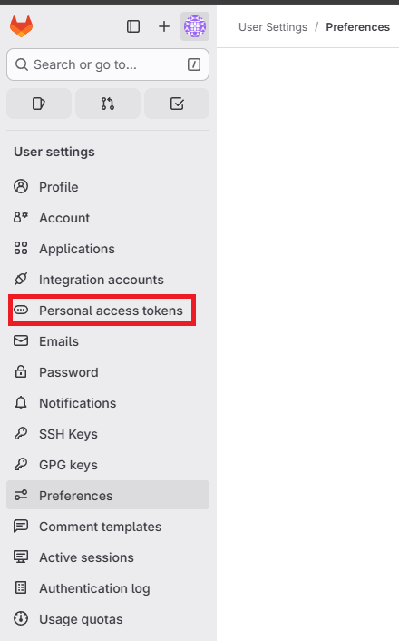

# Hands-on Jenkins Setting Up

## 📌 Introduction
There are multiple ways to deploy Jenkins depending on your infrastructure and operational requirements. Common deployment options include containers, virtual machines, on-prem servers, and even Kubernetes clusters.

In this lab, we will demonstrate two practical installation methods:

### Deploy Jenkins using Docker Compose

- Fast, portable, easy to maintain

- Suitable for testing, labs, and container-based environments

### Install Jenkins directly on a virtual machine (self-hosted)

- Traditional installation method

- Suitable for dedicated servers or environments without container infrastructure

These two approaches will help you understand both containerized and non-containerized Jenkins setups, giving you flexibility to choose the best deployment model for your DevOps workflow.

###  Deploy Jenkins using Docker Compose
#### 
Project folder structure
```bash
cicd-install/
├── docker-compose.yml
├── gitlab
│   ├── config
│   ├── data
│   └── logs
└── jenkins
    └── Dockerfile
```
- Create 'docker-compose.yml' file
```bash
version: '3.9'

services:
  gitlab:
    image: 'gitlab/gitlab-ce:latest'
    container_name: gitlab
    restart: always
    hostname: 'gitlab.defenselab.info'
    extra_hosts:
      - "jenkins.defenselab.info:host-gateway"
    environment:
      GITLAB_OMNIBUS_CONFIG: |
        external_url 'https://gitlab.defenselab.info'
        gitlab_rails['initial_root_password'] = 'your_strong_password'

        # Registry configuration
        registry_external_url 'https://gitlab.defenselab.info:5050'
        gitlab_rails['registry_enabled'] = true
        gitlab_rails['registry_host'] = "gitlab.defenselab.info"
        gitlab_rails['registry_port'] = "5050"
        gitlab_rails['registry_api_url'] = "http://localhost:5050"

    ports:
      - '80:80'
      - '443:443'
      - '22:22'
      - '5050:5050'
    volumes:
      - './config:/etc/gitlab'
      - './logs:/var/log/gitlab'
      - './data:/var/opt/gitlab'
    shm_size: '256m'
    networks:
      gitlab-net:
        aliases:
          - gitlab.defenselab.info

  gitlab-runner:
    image: 'gitlab/gitlab-runner:latest'
    container_name: gitlab-runner
    privileged: true
    depends_on:
      - gitlab
    restart: always
    volumes:
      - './runner-config:/etc/gitlab-runner'
      - '/var/run/docker.sock:/var/run/docker.sock'
    networks:
      - gitlab-net

  jenkins:
    build:
      context: ./jenkins
    container_name: jenkins
    restart: unless-stopped
    privileged: true
    hostname: jenkins.defenselab.info
    user: root
    ports:
      - "8080:8080"
      - "50000:50000"
    volumes:
      - /home/secops/.kube:/root/.kube
      - /home/secops/.minikube:/root/.minikube
      - jenkins_home:/var/jenkins_home
      - /var/run/docker.sock:/var/run/docker.sock
    networks:
      - gitlab-net

# -----------------------------
# Volumes
# -----------------------------
volumes:
  jenkins_home:
    name: jenkins_home

# -----------------------------
# Networks
# -----------------------------
networks:
  gitlab-net:
    name: gitlab-net
```
- Create `jenkins/Dockerile`
```bash
FROM jenkins/jenkins:lts

USER root

# Install Docker, kubectl and dependencies
RUN apt-get update && \
    apt-get install -y ca-certificates curl apt-transport-https gnupg2 lsb-release docker.io && \
    curl -fsSL "https://dl.k8s.io/release/$(curl -L -s https://dl.k8s.io/release/stable.txt)/bin/linux/amd64/kubectl" -o /usr/local/bin/kubectl && \
    chmod +x /usr/local/bin/kubectl /usr/bin/docker || true && \
    apt-get clean && rm -rf /var/lib/apt/lists/*

USER jenkins
```
----

- Run this command `docker compose up -d` to start jenkins service.
- After Jenkins start, access to Jenkins web interface: `http://jenkins.defenselab.info:8080`
- Get the password for your first login
```bash
docker exec -it jenkins cat /var/jenkins_home/secrets/initialAdminPassword
```
----
###  Install Jenkins directly on a virtual machine
In this lab, I'm using Rocky Linux 9 as virtual machine to install Jenkins. This method is suitable for teams that prefer a traditional server-based setup without containers.
- ✅ Update System Packages
```bash
sudo dnf update -y
```
- ✅ Install Java (Required by Jenkins)
  - Jenkins requires Java 17 on Rocky Linux 9.
```bash
sudo dnf install -y java-17-openjdk java-17-openjdk-devel
```
  - Verify Java version:
```bash
java -version
```
- ✅ Add Jenkins Repository
```bash
sudo dnf install -y wget
sudo wget -O /etc/yum.repos.d/jenkins.repo \
    https://pkg.jenkins.io/redhat-stable/jenkins.repo

sudo rpm --import https://pkg.jenkins.io/redhat-stable/jenkins.io.key
```
- ✅ Install Jenkins
```bash
sudo dnf install -y jenkins
```
- ✅ Start and Enable Jenkins Service
```bash
sudo systemctl enable jenkins
sudo systemctl start jenkins
```
  - Check service status:
```bash
sudo systemctl status jenkins
```
- ✅ Open Firewall Ports
```bash
sudo firewall-cmd --permanent --add-port=8080/tcp
sudo firewall-cmd --reload
```
- ✅ Access Jenkins Web Interface
  - Open a browser:
```bash
http://jenkins.defenselab.info:8080
```
- 🎉 Success! we've completed jenkins install with 2 method Docker Compose and Virtual machine.

###  Manage Jenkins
After logging in, you will see the main Jenkins interface
✔ Dashboard
- Displays your jobs and pipelines.

✔ Manage Jenkins
- Central location for system configuration, plugins, credentials, security, and node management.

✔ People
- User management section where you can view and manage Jenkins accounts.

✔ Credentials
- A secure storage area for passwords, tokens, SSH keys, and other sensitive information used in pipelines.

### 🔌 Install Recommended Plugins
There are some recommended Plugins need to install
- Blue Ocean 

- Docker Pipeline

- Kubernetes CLI

- GitLab Plugin

#### 🔗 Connect Jenkins ↔ GitLab via Webhook
- Create Personal Access Token (PAT) in GitLab
`GitLab → Preferences → Access Tokens`

- Required permissions:
  - api
  - read_repository

Save the generated token.


#### Add Credential in Jenkins
Navigate to:
`Manage Jenkins → Credentials → Global → Add Credentials`


